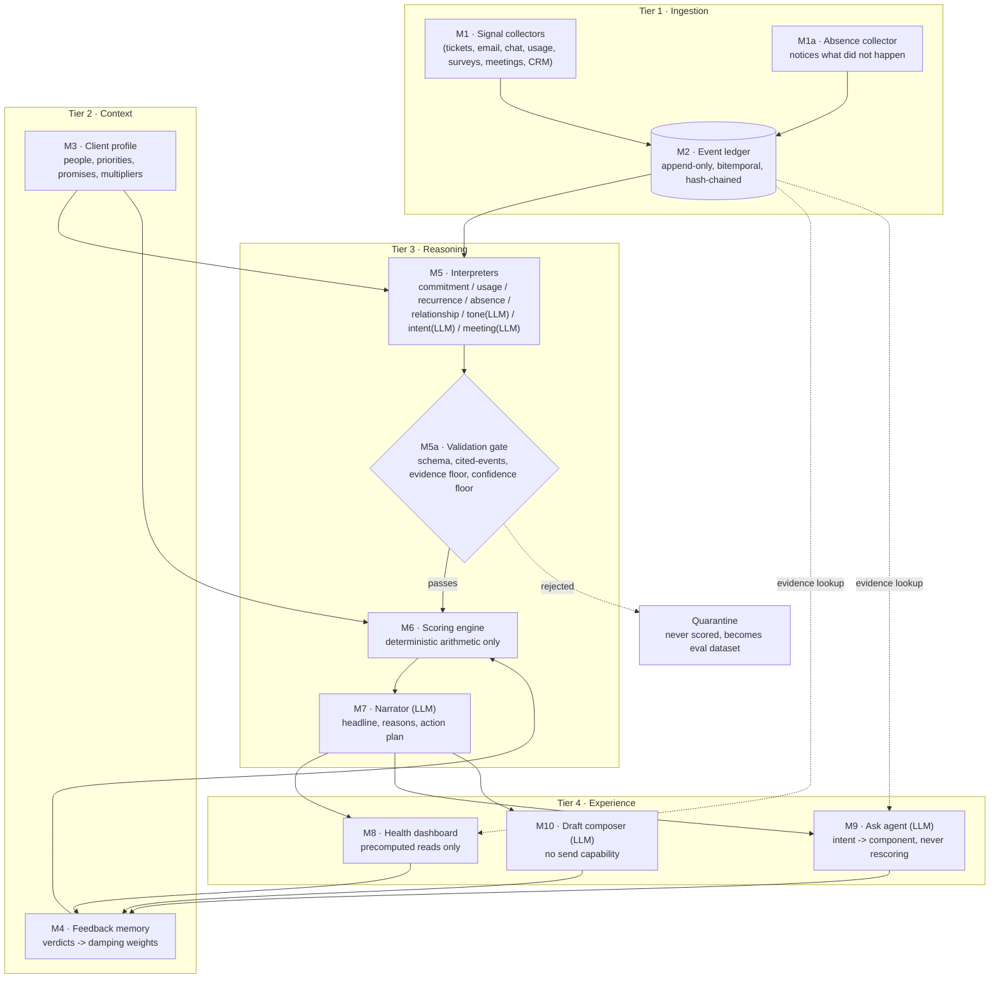
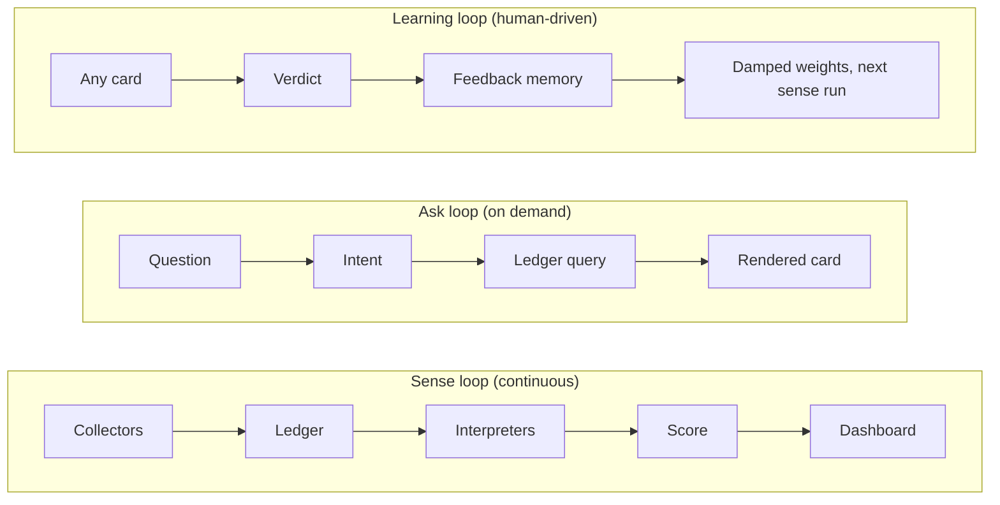

# 01 · Architecture overview

| | |
|---|---|
| **Document** | System architecture — overview |
| **Version** | 1.0 |
| **Source of truth** | `base/Churn-Sentiment-Agent-Product-Specification.md` §9; `requirements/` |

## Design philosophy

The architecture is **event-sourced in shape, not in tooling**. Append-only, bitemporal and replayable are properties of the schema and engineering discipline — not of a message broker or a specialized event-streaming platform. At the target scale (50k–200k events/year per single-client deployment), a relational database with a disciplined access pattern is sufficient and dramatically easier to operate, audit, and reason about than a distributed event bus.

Four tiers, each forbidden from doing the next tier's job (spec P3):

| Tier | Job | Modules |
|---|---|---|
| 1 · Ingestion | Get material onto the ledger without interpreting it | M1 Signal collectors, M2 Event ledger |
| 2 · Context | Supply the lens that turns a signal into a severity | M3 Client profile, M4 Feedback memory |
| 3 · Reasoning | Turn raw material into a defensible number and explanation | M5 Interpreters, M5a Validation gate, M6 Scoring engine, M7 Narrator |
| 4 · Experience | Display, answer, and draft — never calculate | M8 Health dashboard, M9 Ask agent, M10 Draft composer |

## Component diagram

## The three loops

- **Sense loop** — runs on events (webhook/poll) and on a schedule (hourly heartbeat); the only loop that touches the score.
- **Ask loop** — never recomputes the score; explains the one that already exists.
- **Learning loop** — the only loop a human triggers directly; changes future weight, never past scores (spec §8.7: previous score is never an input).

## Technology class per component (see `02-component-catalog.md` for full detail)

| Component | Technology class |
|---|---|
| Signal collectors, Absence collector | Deterministic code (API/webhook adapters) |
| Event ledger | Relational database (append-only tables + triggers) |
| Client profile | Structured config (YAML/DB), human-authored |
| Feedback memory | Deterministic code + relational storage |
| Commitment, Usage, Absence, Relationship readers | Deterministic code / classical statistics |
| Recurrence reader | Embeddings + clustering (no generative call) |
| Tone, Intent, Meeting readers | LLM, structured output |
| Validation gate | Deterministic code |
| Scoring engine | Deterministic arithmetic — **no model call, ever** |
| Narrator, Ask agent, Draft composer | LLM, structured output → templated/checked prose |
| Health dashboard | Read-only UI, no computation |

## Non-functional targets (see `requirements/11-non-functional-requirements.md`)

| Requirement | Target |
|---|---|
| Dashboard load | < 1s |
| Event → updated score | < 60s (target ~40s) |
| Ask agent response | < 3s |
| Determinism | Same ledger + same versions → identical score, always |
| Availability | Degraded operation on partial source failure, never all-or-nothing |
| Scale | 50k–200k events/year per deployment |

## Deployment topology

**One deployment = one client = one database schema/tenant = one encryption key set.** This is a deliberate product constraint (spec §3.2), not a technical limitation — see `03-technology-stack.md` for how this maps to isolated per-tenant infrastructure rather than shared multi-tenant tables.
