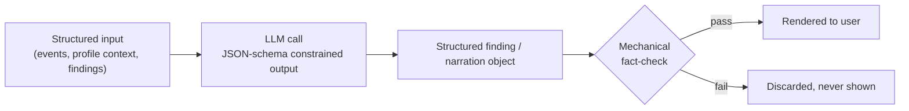

# 04 · AI safety and model usage

Spec §12.4–12.5, §15. This document is the engineering contract for every LLM call in the system (Tone, Intent, Meeting readers; Narrator; Ask agent; Draft composer).

## Rule 1 — Structured output everywhere

Every model call returns a schema-constrained JSON object, never free prose as a scoring/decision artifact. Prose is generated only in three places — the Narrator, the Draft composer, and the Ask agent's `text_only`/`hybrid` responses (`specs/014-ask-agent-response-formats`) — and is itself mechanically checked before display in every one of them (see Rule 4). The Ask agent's own choice of response format (`text_only` / `hybrid` — `specs/023-ask-agent-default-hybrid-responses` retired `component_only` as a distinct, classify-chosen outcome; `hybrid` is now the default for every structured intent) is itself a schema-constrained field on the same classify call that already decides `intent` — never a free judgment made outside a structured-output call.

## Rule 2 — Prompt injection defense is architectural, not prompt-level

Client text (emails, chats, tickets, transcripts) is **untrusted data**, never instructions. This is enforced structurally:

| Control | Applies to |
|---|---|
| Interpreters (M5) have **zero tools** and **zero side effects** — pure function: text in, structured finding out | Tone, Intent, Meeting readers |
| Output validated against **closed enumerations** (e.g. Intent's category field can only be one of a fixed set) | All readers |
| A finding can never become an instruction — the validation gate (M5a) and scoring engine (M6) only ever read typed fields (`magnitude: float`, `confidence: float`, `type: enum`), never a free-text field that could carry a directive | All findings |
| Ask agent (M9) tools are **read-only lookups only** — no tool can write, send, or execute an action | Ask agent |
| Draft composer (M10) has **no send-capable dependency reachable at all** — not a permission that could be escalated, an absent capability | Draft composer |

## Rule 3 — Confidence is first-class

- Every finding carries `confidence` (certainty) and `magnitude` (size) as **separate** fields — never conflated into one score.
- Low-confidence findings render in the UI as "possible" language and contribute a fraction of their weight via the scoring formula's `confidence` term (see `requirements/06-scoring-engine.md`).
- Abstention is a valid, expected output: a reader with insufficient history returns *no finding*, not a low-confidence guess (REQ-M5-04).

## Rule 4 — No new facts (mechanical, not aspirational)

The Narrator (M7), Draft composer (M10), and the Ask agent's (M9) `text_only`/`hybrid` responses each run a deterministic post-generation check before any output reaches a screen. The Ask agent's check reuses the Narrator's own `fact_check()` function directly (a domain-to-domain import, constitution P8) — not a second, independently-maintained implementation of the same rule:

1. Extract every number, name, date, and claim from the generated text.
2. Verify each one exists verbatim (or as a direct derivation, e.g. a computed delta) in the structured input that was given to the model.
3. Any sentence containing an unverifiable claim is dropped from the output entirely — never silently "cleaned up" or rephrased by another model call.

This is what makes "model hallucination" (spec §15 risk table) structurally difficult rather than merely discouraged: hallucinated content can be *generated* but cannot pass the check to be *displayed*.

## Rule 5 — Versioned prompts

- Every prompt template is stored under version control with a semantic version ID.
- A scoring/narration/draft run records exactly which prompt version produced each output.
- Changing a prompt is a **replayable, measurable event** — like a client-profile edit, it can trigger a full replay so historical comparisons remain valid (see `requirements/02-event-ledger.md` REQ-M2-07).
- No prompt is ever edited as an untracked live string in code — prompt changes go through the same review/versioning discipline as code changes.

## Model call inventory

| Component | Model tier | Tools granted | Output contract |
|---|---|---|---|
| Tone reader | Haiku-class | None | `{deviation: float, magnitude: float, confidence: float, cited_event_ids: [uuid]}` |
| Intent reader | Haiku-class | None | `{category: enum, confidence: float, cited_event_ids: [uuid]}` |
| Meeting reader | Haiku-class | None | `{commitments: [{who, what, by_when, source_segment}], confidence: float}` |
| Narrator | Sonnet-class | None (reads structured findings only) | `{headline: string, reasons: [{text, points, evidence_ids}], actions: [{text, owner, due_date, playbook_id}]}` |
| Ask agent (classify) | Sonnet-class | Read-only lookup tools (query ledger, query findings, query score_runs) | `{intent: enum, subject_hint: string\|null, response_mode: enum}` or (decline/fallback) `{fallback_text: string, sources: [uuid]}` |
| Ask agent (text generation, `text_only`/`hybrid` only) | Sonnet-class | None (reads the same already-fetched `component_props` the classify step's matched intent produced — no new tool call) | `{markdown: string}`, mechanically fact-checked (Rule 4) before being attached to the response as a `parts` entry alongside/instead of the rendered component |
| Draft composer | Sonnet-class | None (reads evidence + profile only) | `{draft_text: string, tone_variant: enum, evidence_ids: [uuid]}` |

## What must never appear in a prompt

- Other clients' data (per-deployment isolation guarantees this is structurally impossible — no cross-tenant table exists to query).
- The fact that the client is being monitored or scored (this instruction lives in the Draft composer's system prompt as an explicit negative constraint, and is verified by Rule 4's check for self-referential language).
- Raw credentials, API keys, or internal infrastructure details.
