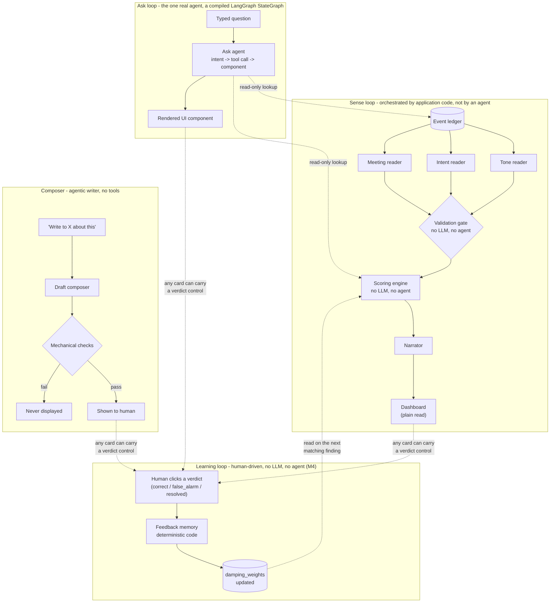

# 05 · Agent catalog

Every LLM-touching component in the system, as an individual "agent card" — role, inputs, outputs, permitted tools, and decision logic — followed by an honest answer to the question a demo judge will actually ask: **is this genuinely agentic, or is it six API calls wearing a trench coat?**

## The honest answer, up front

It's neither extreme. None of these six components plans multi-step tasks autonomously, negotiates with another agent, or decides its own goals — that would be a real reach for a product whose entire premise (P2, P3) is that judgment stays narrowly scoped and checkable. But calling them "just API calls" undersells two of them. Here's where each one actually sits:

| Component | Tool use? | Multi-step reasoning? | Where it sits |
|---|---|---|---|
| Tone / Intent / Meeting readers | **No — zero tools** (REQ-M5-P2) | No — single structured-extraction call | **Not agentic.** Deliberately: prompt-injection containment requires zero tools and zero side effects here. Call it "an LLM classifier," not "an agent." |
| Narrator | No tools | No — single generation call over pre-ranked input | **Not agentic**, same reasoning — it's a templated-but-flexible writer, not a decision-maker. |
| **Ask agent** | **Yes — read-only lookup tools** (query ledger, query findings, query score_runs) | **Yes** — classifies intent, decides which tool(s) to call, decides which UI component to populate | **The genuinely agentic one.** A small, tightly-scoped ReAct-style loop: reason about the question → choose a tool → read the result → choose a rendering. Literally built as one — a compiled LangGraph `StateGraph`, the only orchestration library anywhere in this system (`decisions/03-langgraph-for-ask-agent.md`). |
| Draft composer | No tools (reads pre-fetched evidence + profile, doesn't fetch anything itself) | Some — synthesizes multiple inputs (evidence, communication norms, thread history) into one coherent artifact, then runs itself through checks | **Borderline.** More reasoning than the readers, no tool-use, so it's an agentic *writer* rather than an agentic *actor*. |

If a judge asks "is this agentic," the accurate answer is: **the system has one real agent (the Ask agent) and five narrowly-scoped LLM functions around it — and that ratio is a deliberate design choice, not a limitation.** Every place the spec could have made something "more agentic" by giving it tools or autonomy (the readers, the narrator, the composer) is exactly where product principle P3 ("each component refuses to do the next one's job") and the prompt-injection containment model (`architecture/04-ai-safety-and-model-usage.md`) require it not to be.

---

## Agent cards

### Tone reader

| | |
|---|---|
| **Role** | Answer one question: is this person writing differently than *they* normally do? |
| **Model** | Haiku-class (`decisions/02-repo-and-tooling.md`) |
| **Inputs** | New message text + the stakeholder's confirmed baseline (`data-base/03-schema-ledger.md` `baseline_confirmations` + `rollups`) |
| **Outputs** | `{deviation, magnitude, confidence, cited_event_ids}` — closed schema, nothing else |
| **Tools permitted** | **None.** Zero tool access, zero side effects (REQ-M5-P2). |
| **Decision logic** | Structured comparison against baseline; abstains below 5 historical samples (REQ-M6-CAL-04). Never sees or reasons about any other stakeholder's data. |
| **Failure mode** | See `architecture/06-error-handling.md` §Reader timeouts. |

### Intent reader

| | |
|---|---|
| **Role** | Classify escalation / competitive / contractual language against a closed enum. |
| **Model** | Haiku-class |
| **Inputs** | New message/ticket text |
| **Outputs** | `{category: enum, confidence, cited_event_ids}` |
| **Tools permitted** | **None.** |
| **Decision logic** | Closed-enum classification only — never open text (REQ-M5-13). Also backs the Pass 1/Pass 2 urgent-phrase mechanism (`requirements/13-scoring-calibration-appendix.md` REQ-M6-CAL-08) — Pass 1 is a separate, non-LLM keyword router; this agent card is Pass 2, the real classification, always fully validated. |
| **Failure mode** | See `architecture/06-error-handling.md` §Reader timeouts. |

### Meeting reader

| | |
|---|---|
| **Role** | Extract verbal commitments (who promised what, by when) from consented transcripts. |
| **Model** | Haiku-class |
| **Inputs** | Transcript segment, only from meetings with documented all-party consent |
| **Outputs** | `{commitments: [{who, what, by_when, source_segment}], confidence}` |
| **Tools permitted** | **None.** |
| **Decision logic** | Idle in the MVP — no transcript source connected yet (`decisions/01-mvp-scope-and-phasing.md`); correctly abstains every run until Post-MVP. |
| **Failure mode** | N/A while idle; see `architecture/06-error-handling.md` §Reader timeouts once active. |

### Narrator

| | |
|---|---|
| **Role** | Turn a ranked, already-scored breakdown into a headline, reasons, and an action list. |
| **Model** | Sonnet-class |
| **Inputs** | Ranked findings/issues + point contributions (M6 output) — never raw events, never the ledger directly |
| **Outputs** | `{headline, reasons[], actions[]}`, then mechanically fact-checked before display (REQ-M7-06) |
| **Tools permitted** | **None.** |
| **Decision logic** | Zero re-ranking (REQ-M7-P2). Actions are personalizations of `playbook_actions` templates only — never invented (REQ-M7-04). |
| **Failure mode** | See `architecture/06-error-handling.md` §What if the fact-check discards everything. |

### Ask agent

| | |
|---|---|
| **Role** | Answer a typed question by classifying its intent, looking up already-computed data, and rendering a UI component. |
| **Model** | Sonnet-class |
| **Orchestration** | **LangGraph** — a compiled `StateGraph` (`classify_intent` → branch → tool-calling loop / decline / fallback / handoff → `render_component`), the only one of the six LLM touchpoints built this way. Full design: `decisions/03-langgraph-for-ask-agent.md`. |
| **Inputs** | User question text |
| **Outputs** | `{intent, component, component_props}` or `{fallback_text, sources}` |
| **Tools permitted** | **Read-only lookup tools only**, registered via `AskAgentToolkit`: query ledger, query findings, query `score_runs` — thin wrappers around the same repository ports M1–M6 already use. No write tool exists in this agent's toolset, structurally — see `architecture/04-ai-safety-and-model-usage.md`. |
| **Decision logic** | Closed intent menu (REQ-M9-02); declines predictions and colleague judgments outright, without a tool call (REQ-M9-05/06) — the fastest, cheapest path through the graph, since declining needs no lookup. |
| **Failure mode** | See `architecture/06-error-handling.md` §What if the intent classifier fails. |

### Draft composer

| | |
|---|---|
| **Role** | Write a client-facing message from the top issue's evidence and the client's communication style. |
| **Model** | Sonnet-class |
| **Inputs** | Top issue + evidence (M6/M7 output), client profile communication norms, thread history |
| **Outputs** | `{draft_text, tone_variant, evidence_ids}`, then four mechanical checks before display (REQ-M10-07) |
| **Tools permitted** | **None.** Reads pre-fetched evidence/profile passed in as input — never fetches anything itself, and has no send-capable dependency in its runtime at all (REQ-M10-P1). |
| **Decision logic** | Acknowledge-first, one-ask, rhythm-matched (REQ-M10-02/03/04). Never writes blame, invented facts, discounts, or self-referential ("you're being monitored") language (REQ-M10-P2…P6). |
| **Failure mode** | A failed check blocks display entirely — no partial or "cleaned up" draft is ever shown (`requirements/10-draft-composer.md` §Non-functional constraints). |

---

## Collaboration diagram — orchestration, not conversation

None of these six agents talk to each other. There is no agent-to-agent message-passing anywhere in this system — every handoff is a plain function call or a database write/read, orchestrated by ordinary application code. This is deliberate: an actual multi-agent conversation would be one more surface for prompt injection to travel across, and the whole architecture is built to keep client text contained (`architecture/04-ai-safety-and-model-usage.md`).

Every arrow into an LLM box is application code deciding to call it, not one agent deciding to call another. The learning loop is the clearest case of this: a verdict click never talks to a model at all — it's a stored numeric weight (`architecture/02-component-catalog.md` §Feedback memory), read back in on a *future* scoring run, never rewriting a past one (`requirements/06-scoring-engine.md` REQ-M6-20).

## Traceability

`architecture/02-component-catalog.md`, `architecture/04-ai-safety-and-model-usage.md`, `requirements/05-interpreters-readers.md`, `requirements/07-narrator.md`, `requirements/09-ask-agent.md`, `requirements/10-draft-composer.md`.
