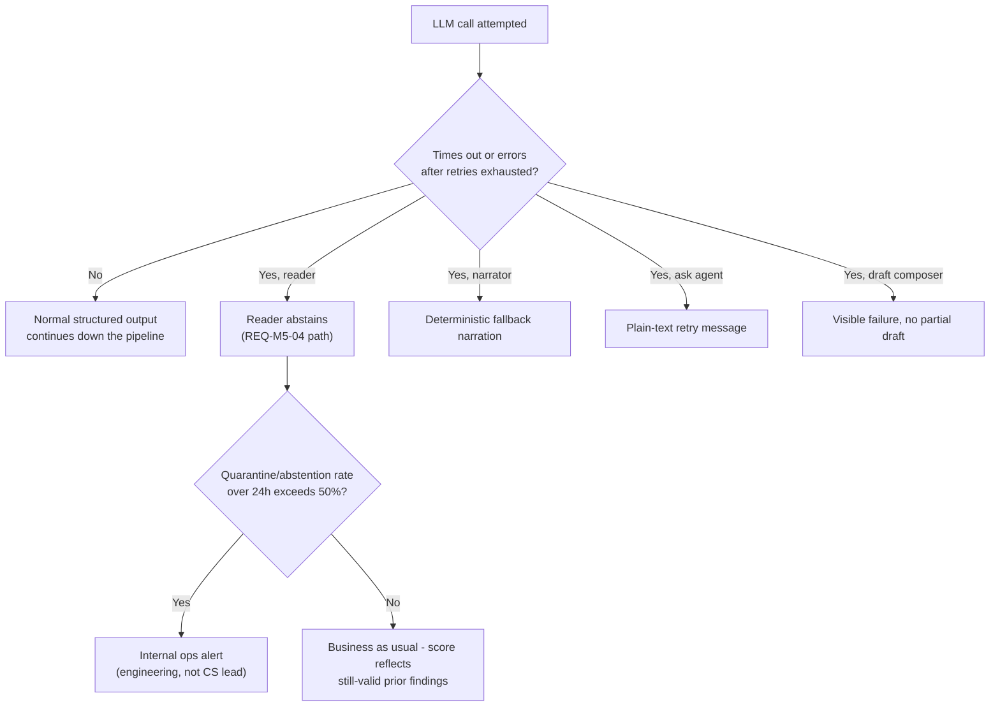

# 06 · Error handling

Every place the happy path in `sequences/01-sequence-signal-to-score.md` can actually fail, and what the system does about it. Nothing in this document is optional polish — a live demo (`demo/01-live-demo-runbook.md`) that has no answer for "what if the LLM call times out mid-demo" is one bad network blip away from failing in front of the judges.

## LLM call retries, backoff, and timeout — inside the 40s budget

Every reader call and every generation call gets a fixed timeout and a bounded retry policy, sized so the whole pipeline still lands inside the ~40s end-to-end target (`requirements/11-non-functional-requirements.md` REQ-NFR-02) even in the worst case that still succeeds.

| Caller | Per-attempt timeout | Retries | Backoff | Worst case (all attempts) | On exhaustion |
|---|---|---|---|---|---|
| Tone / Intent / Meeting readers | 8s | 2 | 1s, 2s | ~8+1+8+2+8 = 27s | **Abstain** — treated identically to REQ-M5-04's "no history, no opinion." Not quarantined (quarantine is for findings that were produced but failed validation; a reader that never produced anything has nothing to quarantine). |
| Narrator | 10s | 1 | 2s | ~10+2+10 = 22s | See "What if the fact-check discards everything," below — the same deterministic fallback applies to a total narrator failure. |
| Ask agent (`component_only`) | 2.5s | 0 | — | 2.5s | Falls back to plain text immediately: *"That's taking longer than it should — try again, or check the dashboard directly."* No retry, because a retry would already blow REQ-M9-08's 3s budget on its own. |
| Ask agent (`text_only`/`hybrid` text-generation step, `specs/014-ask-agent-response-formats`) | 15s (hard `asyncio.wait_for` cap, not just a documented target) | 0 | — | 15s for this call, on top of the classify call above | Live-tested against the real model during implementation: without an explicit cap, this call rode on the shared `LLMPort` adapter's own internal 3-attempt retry and one real run took 72s; asking the model for a short (2-4 sentence) answer brought typical real generation to ~7-8s, so 15s is real headroom, not a guess. If this call fails/times out after `component_props` was already fetched successfully, the response silently degrades to a `component_only`-shaped `parts` list — never a partial or corrupted Markdown fragment, and never the generic "taking longer than expected" message when a complete component answer is already in hand. |
| Draft composer | 10s | 1 | 2s | ~10+2+10 = 22s | Draft generation fails visibly — *"Couldn't generate a draft — try again"* — never a partial or silently-empty draft. |

Tone and Intent run in parallel (`sequences/01-sequence-signal-to-score.md`), so their worst cases don't stack — the pipeline's total worst case is bounded by the slower of the two plus the fixed downstream steps (gate, scoring, narrator), which is what keeps a worst-case run inside REQ-NFR-02's 60s hard ceiling even when a retry fires.

## Meeting audio ingestion — resilience budget (specs/019-meeting-audio-ingestion)

A background/on-demand collection cycle (`AudioCollector`, scheduled poll or manual refresh), not a request inside the 40s dashboard-load budget above — a single long recording is allowed to take minutes, not seconds, without threatening any user-facing latency target. The two failure shapes are handled differently, matching FR-012/FR-013:

| Caller | Per-attempt timeout | Retries | On exhaustion |
|---|---|---|---|
| Google Drive API (list/download) | Client library default (no custom override) | Client library default | A genuine auth failure raises `GoogleDriveAuthenticationError` immediately (no retry — an expired/revoked token doesn't fix itself on a second attempt); any other Drive error propagates as a whole-cycle failure, caught by `RunCollectorUseCase.execute()`'s `try/except` (research.md Decision 5) |
| OpenAI Whisper transcription (one recording) | 300s (5 min), no `asyncio`-level retry beyond the OpenAI SDK's own built-in transport retries | 0 additional | Per-item failure (FR-013) — logged, that recording skipped, the cycle continues |
| Speaker-diarization pass (pyannote.ai hosted API, one recording) | 300s (5 min) | 0 | Per-item failure (FR-013), same as above — a diarization timeout doesn't distinguish itself from a transcription timeout at the `AudioCollector.fetch()` level, both are simply "this item failed" |
| Speaker-name-matching LLM call (`WhisperTranscriptionAdapter._match_speakers`) | Reuses the Tone/Intent/Meeting readers' existing 8s × 2 retries budget above verbatim (the same `AnthropicLLMAdapter`, no separate adapter or policy) | 2 | Falls back to every speaker staying unattributed (`"Unknown Speaker"`) — never blocks the transcript, never a guessed name (FR-007) |

**Not yet live-tested against a real recording** (this sandboxed implementation environment has no real Google Drive/OpenAI Whisper/pyannote.ai access) — the 300s figures above are a documented, deliberately generous initial estimate (OpenAI's Whisper API commonly processes well inside that window; the diarization pass now polls a hosted job — research.md Decision 7's correction, moved off a locally-run `pyannote.audio` pipeline — so its realistic risk of running long shifts from CPU-only hardware to the third-party queue/processing time for a lengthy recording), not a number arrived at by observing real timings the way the Ask agent's 15s cap was (that budget's own row, above, is the precedent this one should eventually match). Recalibrate once a real deployment has run this against actual meeting recordings — the same follow-up `specs/019-meeting-audio-ingestion/plan.md`'s Constitution Check already flags.

A whole-cycle failure (Drive auth) freezes the score at its last value via the existing coverage/degrade mechanism (`specs/004-score-engine` FR-011) — see that spec's own resilience treatment; this table only covers the ingestion-side call budgets, not the scoring-side freeze behavior they feed into.

## Dead-letter handling for invalid envelopes

A malformed webhook payload (source sends something that doesn't parse, or is missing a required field) must never crash a collector or silently vanish. It also can't become a `raw_envelopes` row — that table's columns are `NOT NULL` by design (`data-base/10-ddl-appendix.md`), so a genuinely unparseable payload has nowhere valid to land.

**Design:** a lightweight `ingestion_failures` table catches it before `raw_envelopes` is attempted:

```sql
CREATE TABLE ingestion_failures (
    id                UUID PRIMARY KEY DEFAULT gen_random_uuid(),
    collector_run_id  UUID NOT NULL REFERENCES collector_runs(id),
    source_native_id  TEXT,                  -- best-effort, may be unparseable too
    raw_payload       JSONB,                 -- captured as-is for debugging, never trusted as data
    error             TEXT NOT NULL,
    created_at        TIMESTAMPTZ NOT NULL DEFAULT now()
);
```

*(Flagged here rather than silently pre-added to `data-base/10-ddl-appendix.md`: this is a genuinely new table this document is proposing, not one already implied elsewhere — add it in the same migration that first ships a collector, not before.)* A collector that hits a parse failure writes one row here and continues to the next item in its batch — one bad payload never stops the rest of a sync (matches REQ-NFR-06's "degraded, never all-or-nothing"). `ingestion_failures` rows are visible on the System health screen alongside `quarantine`, giving one place to see everything the system couldn't use, at every stage of the pipeline.

## What if the validation gate rejects everything this run?

This is less dramatic than it sounds, because of REQ-M6-20: the scoring engine recomputes from *all currently-valid findings*, not just this run's new candidates. If every finding proposed in one run gets quarantined, the score simply doesn't gain any new evidence this run — findings that were already `validated` from prior runs (still `open`, not superseded) keep contributing exactly as before, and the score moves only from time-based effects (ageing, fade) already in motion.

What *is* an incident: a **sustained** high quarantine rate. If the rolling 24-hour quarantine rate exceeds **50%**, the system SHALL raise an internal ops alert (distinct from any client-facing dashboard state) — this is a signal of reader regression (a prompt change, a model deprecation, a schema drift) that needs an engineer, not a CS lead. It is never surfaced to the CS lead as if it were an account-health problem.

## What if the fact-check discards every sentence (Narrator)?

`requirements/07-narrator.md` REQ-M7-07 discards any sentence that fails the mechanical fact-check. If every generated reason and the headline itself fail — an extreme case, but not an impossible one — the dashboard falls back to a **deterministic, non-LLM narration** built directly from the scoring engine's own structured output, with no generation step at all:

```
"{score} — {band}. Top issue: {issue.label} ({issue.points} pts). See evidence trace for detail."
```

This fallback is clearly marked in the UI as auto-generated, not narrated — the same honesty pattern the Ask agent already uses for its fallback text (REQ-M9-04). The dashboard is never blank, and it never displays a narrator sentence that failed its own honesty check.

## What if the Ask agent's intent classifier errors (not "no match" — an actual failure)?

Distinct from REQ-M9-04's "no intent matched" path (a normal, expected outcome with its own fallback). This is the model call itself failing — timeout, provider 5xx, malformed response. Handling: the 2.5s/no-retry policy above applies, the user sees the generic retry message, and the attempt is logged to `ask_queries` with `response_time_ms` set and a `NULL` `matched_intent` — indistinguishable in the data from a genuine no-match at query time, which is acceptable since both cases get the same UI treatment (a plain-text response, not a fabricated component). Tracking the *rate* of this distinct from genuine no-matches is a Post-MVP observability refinement, not a Phase 1 blocker.

## Degraded mode, end to end

Extending REQ-M6-26 (frozen score on a disconnected source) to the reader layer: if an LLM provider is unreachable for an extended period, the deterministic and statistical readers (Commitment, Usage, Recurrence, Absence, Relationship) keep working normally — none of them call an LLM. Only Tone, Intent, and Meeting go dark. The dashboard's coverage line already communicates *source* health (`requirements/08-health-dashboard.md` REQ-M8-06); the same honesty extends to *reader* health — a "Tone and Intent unavailable since HH:MM" note alongside the normal coverage line, so a CS lead sees a partial picture and knows it's partial, rather than a quiet score that looks identical to a healthy one (product principle P5).



## Traceability

`requirements/11-non-functional-requirements.md` (REQ-NFR-02, REQ-NFR-06), `requirements/05-interpreters-readers.md` (REQ-M5-04, REQ-M5A-*), `requirements/06-scoring-engine.md` (REQ-M6-20, REQ-M6-26), `requirements/07-narrator.md` (REQ-M7-06/07), `requirements/09-ask-agent.md` (REQ-M9-04/08), `architecture/05-agent-catalog.md`.
