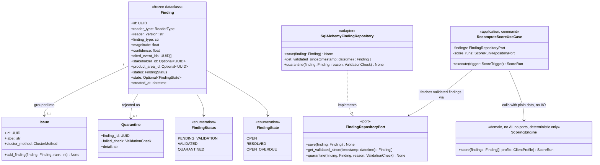

# 08 · Class diagrams — Collectors, Readers, Findings

Implementation-level detail that `architecture/02-component-catalog.md` deliberately doesn't go into: the actual classes, interfaces, and relationships for the three pieces of the pipeline where the "AI or not AI" line is drawn most sharply — **Collectors** (M1, never touch AI), **Readers** (M5, the only place AI touches raw client text), and **Findings** (the data contract AI produces but never touches again). Read this alongside `decisions/02-repo-and-tooling.md` §Module → package mapping for where each class actually lives in the repo.

**How to read these diagrams:** standard UML via Mermaid `classDiagram` — `<|--` is inheritance, `..|>` is interface implementation, `-->` is a uses/association relationship, `*--` is composition. `~T~` denotes a generic (`Optional~UUID~` = `Optional[UUID]` in Python terms).

**Updated for the layering in `architecture/09-clean-architecture-and-patterns.md`.** Every interface below is now explicitly stereotyped `<<port>>` (defined in the Application ring, owned by the use case that needs it) with its concrete implementation stereotyped `<<adapter>>` (Adapters ring, the only place SDK/framework code is allowed to live) — `..|>` marks that implementation relationship. If you're implementing one of these classes: a `<<port>>` is an interface you write once and barely touch again; a `<<adapter>>` is where the actual `anthropic`/`openai`/`sqlalchemy` import goes.

---

## 1. Collectors (M1) — zero AI, by construction

```mermaid
classDiagram
    class Collector {
        <<abstract, template method>>
        +source_type: SourceType
        +run(window: TimeWindow) CollectorRunResult
        #fetch(window: TimeWindow) RawPayload[]
        #normalize(payload: RawPayload) Envelope
    }
    class GmailCollector {
        <<adapter>>
        #fetch(window) RawPayload[]
        #normalize(payload) Envelope
    }
    class ZendeskCollector {
        <<adapter>>
        #fetch(window) RawPayload[]
        #normalize(payload) Envelope
    }
    class WarehouseCollector {
        <<adapter>>
        #fetch(window) RawPayload[]
        #normalize(payload) Envelope
    }
    class SlackCollector {
        <<adapter, Post-MVP>>
        #fetch(window) RawPayload[]
        #normalize(payload) Envelope
    }
    class AbsenceCollector {
        <<adapter, scheduled, not source-backed>>
        +check_expected_contact(commitment: Commitment) Optional~Envelope~
    }
    class IdentityResolver {
        +resolve(identifier: str, source_type: SourceType) IdentityMatch
        -exact_match(identifier: str) Optional~Stakeholder~
        -fuzzy_suggest(identifier: str) Optional~FuzzyMatch~
    }
    class Envelope {
        <<frozen dataclass>>
        +id: UUID
        +source_native_id: str
        +idempotency_key: str
        +occurred_at: datetime
        +identity_status: IdentityStatus
        +redacted_fields: str[]
        +payload_encrypted: bytes
        +data_key_ref: str
    }
    class CoverageReporter {
        +report(run: CollectorRunResult) CoverageReport
    }
    class EventRepositoryPort {
        <<port>>
        +append(envelope: Envelope) Event
    }
    class SqlAlchemyEventRepository {
        <<adapter>>
        +append(envelope: Envelope) Event
    }

    Collector <|-- GmailCollector
    Collector <|-- ZendeskCollector
    Collector <|-- WarehouseCollector
    Collector <|-- SlackCollector
    Collector <|-- AbsenceCollector
    Collector --> IdentityResolver : resolves identity via
    Collector --> Envelope : produces
    Collector --> CoverageReporter : reports through
    Collector --> EventRepositoryPort : persists via
    SqlAlchemyEventRepository ..|> EventRepositoryPort : implements
```

### How AI interacts with this layer: it doesn't

There is no `LLMPort` reference anywhere in this diagram, and that's the point, not an oversight. `Collector.run()` is a **Template Method**: the fixed sequence — fetch, normalize, resolve identity, persist via `EventRepositoryPort`, report coverage — lives once in the base class; only `fetch` and `normalize` are overridden per source, which is also exactly where each subclass earns its `<<adapter>>` stereotype (they're the only methods that touch a real SDK). `requirements/01-signal-collectors.md` REQ-M1-P1…P5 forbid a collector from judging importance or filtering content — giving `Collector` an `LLMPort` dependency would be the concrete implementation of exactly that violation, so neither the template method nor either overridable hook has a parameter that could hold one. If you're implementing a new source adapter and find yourself wanting to import `app.llm` into `backend/app/ingestion/collectors/`, that's the signal you've misread which module you're building.

`IdentityResolver.fuzzy_suggest` may use a lightweight string-similarity library (`rapidfuzz`, per `decisions/02-repo-and-tooling.md`) — that's pattern matching, not inference, and it only ever *suggests*; `REQ-M6-CAL-05` sets the confidence floor and `REQ-M1-05` forbids it from resolving on its own. `EventRepositoryPort` is the Repository pattern doing double duty: production wiring points it at `SqlAlchemyEventRepository`; the golden-replay test suite (`tests/strategy.md`) points the exact same `Collector.run()` code at an in-memory fake, with zero changes to any collector subclass.

---

## 2. Readers (M5) — the one place AI reads client text

```mermaid
classDiagram
    class Reader {
        <<abstract, application>>
        +reader_type: ReaderType
        +interpret(events: Event[], context: ClientProfile) Finding[]
    }
    class CommitmentReader {
        +interpret(events, context) Finding[]
    }
    class UsageReader {
        +interpret(events, context) Finding[]
    }
    class RecurrenceReader {
        -embedding_port: EmbeddingPort
        +interpret(events, context) Finding[]
        -cluster(vectors: float[][]) Cluster[]
    }
    class AbsenceReader {
        +interpret(events, context) Finding[]
    }
    class RelationshipReader {
        +interpret(events, context) Finding[]
    }
    class ToneReader {
        -llm_port: LLMPort
        +interpret(events, context) Finding[]
        -baseline_for(stakeholder: Stakeholder) Optional~Baseline~
    }
    class IntentReader {
        -llm_port: LLMPort
        +interpret(events, context) Finding[]
    }
    class MeetingReader {
        -llm_port: LLMPort
        +interpret(events, context) Finding[]
    }
    class LLMPort {
        <<port>>
        +generate_structured(prompt: str, schema: JSONSchema) dict
    }
    class AnthropicLLMAdapter {
        <<adapter>>
        +model_id: str
        +generate_structured(prompt: str, schema: JSONSchema) dict
    }
    class EmbeddingPort {
        <<port, not generative>>
        +embed(text: str) float[]
    }
    class OpenAIEmbeddingAdapter {
        <<adapter>>
        +embed(text: str) float[]
    }
    class ValidationGate {
        +validate(finding: Finding, window: EventWindow) ValidationResult
        -check_schema(finding: Finding) bool
        -check_cited_events_exist(finding: Finding, window: EventWindow) bool
        -check_evidence_count(finding: Finding) bool
        -check_confidence_floor(finding: Finding) bool
    }
    class RunReadersUseCase {
        <<application, command>>
        -readers: Reader[]
        -gate: ValidationGate
        +execute(events: Event[], context: ClientProfile) Finding[]
    }

    Reader <|-- CommitmentReader
    Reader <|-- UsageReader
    Reader <|-- RecurrenceReader
    Reader <|-- AbsenceReader
    Reader <|-- RelationshipReader
    Reader <|-- ToneReader
    Reader <|-- IntentReader
    Reader <|-- MeetingReader
    ToneReader --> LLMPort : structured call, zero tools
    IntentReader --> LLMPort : structured call, zero tools
    MeetingReader --> LLMPort : structured call, zero tools
    RecurrenceReader --> EmbeddingPort : embeddings only
    AnthropicLLMAdapter ..|> LLMPort : implements
    OpenAIEmbeddingAdapter ..|> EmbeddingPort : implements
    RunReadersUseCase --> Reader : runs each registered reader
    RunReadersUseCase --> ValidationGate : every output passes through
```

### How AI interacts with this layer: narrowly, on purpose

Only three of the eight `Reader` subclasses hold an `LLMPort` reference — `ToneReader`, `IntentReader`, `MeetingReader`. The other five (`CommitmentReader`, `UsageReader`, `AbsenceReader`, `RelationshipReader` — code/statistics — and `RecurrenceReader`, which touches `EmbeddingPort` but never `LLMPort`) have no AI dependency at all; this is the class-level expression of `architecture/02-component-catalog.md`'s technology-class column. `RunReadersUseCase` (the Command from `architecture/09-clean-architecture-and-patterns.md`) is what actually iterates the registered readers and hands every output to `ValidationGate` — no reader calls another reader, and no reader talks to `ValidationGate` directly.

The interface shape itself is the containment mechanism, not a convention someone has to remember:

- **`LLMPort.generate_structured(prompt, schema)` takes no tools parameter.** There is no method on this interface that could attach a tool, because giving a reader tool access is exactly what `requirements/05-interpreters-readers.md` REQ-M5-P2 forbids. Compare this to the Ask agent's client (`architecture/05-agent-catalog.md`), which *does* carry a `tools` parameter restricted to read-only lookups — the two are deliberately different port types, not the same interface configured differently, so a reader can never accidentally be handed a tool-enabled client. `AnthropicLLMAdapter` is the only class in this diagram that imports the `anthropic` SDK.
- **Every `Reader.interpret()` call ends at `ValidationGate`, via `RunReadersUseCase`.** No reader's output reaches `Finding` storage without passing through the four checks — enforced by the return type: `interpret()` returns `Finding[]` in `pending_validation` status only; nothing downstream of a reader can promote a `Finding` to `validated` except `ValidationGate`.
- **`EmbeddingPort.embed()` returns a vector, never text.** `RecurrenceReader` clusters those vectors (`HDBSCAN`, per `decisions/02-repo-and-tooling.md`) — there is no code path from "read some client tickets" to "generate a decision" that skips the deterministic clustering step, because the port's return type makes a generative shortcut structurally unavailable. `OpenAIEmbeddingAdapter` is the only class in this diagram that imports the `openai` SDK.

---

## 3. Findings — AI's output, never AI's input again

### How AI interacts with this layer: it doesn't, after creation

`Finding` is a frozen dataclass — once a `Reader` produces one, nothing mutates its `magnitude`, `confidence`, or `cited_event_ids`. What *does* change is `status` (via `ValidationGate`) and `state` (via `ScoringEngine`'s recency logic, `requirements/06-scoring-engine.md`) — both deterministic, both outside any class that holds an `LLMPort`. No class in this diagram — `Issue`, `Quarantine`, `FindingRepositoryPort`, `ScoringEngine`, `RecomputeScoreUseCase` — has an AI dependency of any kind. This is the concrete reason `architecture/04-ai-safety-and-model-usage.md`'s hallucination defense works structurally rather than by discipline: even if a `Reader` somehow produced a `Finding` with fabricated content, every class that touches it afterward only ever reads typed, already-validated fields — there's no code path where a `Finding`'s content could be reinterpreted or "cleaned up" by another model call.

Notice `ScoringEngine` itself has **no** dependency on `FindingRepositoryPort` — it's pure Domain (`architecture/09-clean-architecture-and-patterns.md`): a plain function of `Finding[]` and `ClientProfile` in, `ScoreRun` out, no I/O of any kind. `RecomputeScoreUseCase` (Application) is what fetches findings through the port, calls `ScoringEngine`, and persists the result through `ScoreRunRepositoryPort` — this is the difference between "the scoring formula" (testable with a plain `assert`, zero mocks) and "the act of recomputing a client's score" (needs a database, needs to be a use case).

---

## Summary — where the AI boundary actually sits, class by class

| Class | Ring | Holds `LLMPort`? | Holds `EmbeddingPort`? | Notes |
|---|---|---|---|---|
| `GmailCollector`, `ZendeskCollector`, `WarehouseCollector`, `SlackCollector`, `AbsenceCollector` | Adapters | No | No | Deterministic, always |
| `IdentityResolver`, `CoverageReporter` | Application | No | No | Fuzzy string matching, not inference |
| `EventRepositoryPort` / `SqlAlchemyEventRepository` | Application (port) / Adapters (adapter) | No | No | Repository pattern — swappable for the golden-replay in-memory fake |
| `CommitmentReader`, `UsageReader`, `AbsenceReader`, `RelationshipReader` | Application | No | No | Code/statistics readers |
| `RecurrenceReader` | Application | No | **Yes** | Embeddings for clustering only, never generative |
| `ToneReader`, `IntentReader`, `MeetingReader` | Application | **Yes** | No | Zero-tool, structured-output-only calls |
| `AnthropicLLMAdapter` / `OpenAIEmbeddingAdapter` | Adapters | — | — | The *only* two classes in this entire document that import an AI SDK directly |
| `ValidationGate`, `RunReadersUseCase` | Application | No | No | Four deterministic checks; orchestration only |
| `Finding`, `Issue`, `Quarantine` | Domain | No | No | Pure data |
| `FindingRepositoryPort` / `SqlAlchemyFindingRepository` | Application (port) / Adapters (adapter) | No | No | Repository pattern |
| `ScoringEngine` | **Domain** | No | No | REQ-M6-P1 — pure function, zero I/O, zero ports; enforced by `import-linter` (`architecture/09-clean-architecture-and-patterns.md` §Enforcement) |
| `RecomputeScoreUseCase` | Application | No | No | Orchestrates the port + the pure domain engine |

Two classes in the entire ingestion-through-findings pipeline import an AI SDK — `AnthropicLLMAdapter` and `OpenAIEmbeddingAdapter`. Everything that *uses* AI (`ToneReader`, `IntentReader`, `MeetingReader`, `RecurrenceReader`) does so through a port it doesn't own the implementation of. That's the number worth remembering when explaining this architecture to someone new to it — not "AI reads everything," but "AI reads exactly the three things that need judgment, through an interface narrow enough to fit in one line, and nothing it produces is ever trusted again without a validation step in between."

## Traceability

`architecture/09-clean-architecture-and-patterns.md` (the ring/layer model these stereotypes implement, SOLID mapping, design patterns catalog), `architecture/02-component-catalog.md` (component-level responsibilities these classes implement), `architecture/04-ai-safety-and-model-usage.md` (why the LLM boundary is drawn here), `architecture/05-agent-catalog.md` (the same boundary, at the orchestration level rather than the class level), `requirements/01-signal-collectors.md`, `requirements/05-interpreters-readers.md`, `data-base/05-schema-reasoning.md` (the `Finding`/`Issue`/`Quarantine` schema these classes map onto), `decisions/02-repo-and-tooling.md` (module → package mapping).
