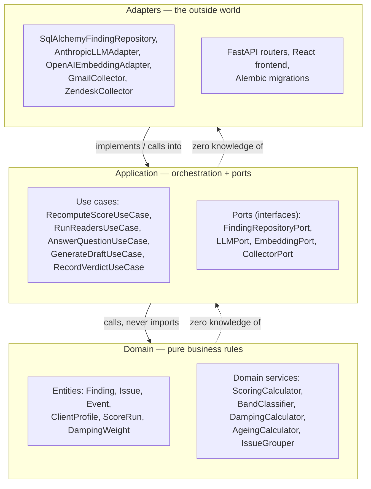

# 09 · Clean Architecture, SOLID, and design patterns

A coding-level architecture proposal — how source code should actually be organized, which principles govern it, and which patterns are already implicit in the design and worth naming explicitly. This document answers "how do I structure the code," where `architecture/08-class-diagrams.md` answers "what are the classes."

## The recommendation, up front

**Yes, Clean Architecture — with one deliberate simplification.** Robert C. Martin's original is four rings (Entities, Use Cases, Interface Adapters, Frameworks & Drivers) organized **by layer** at the top level. This document recommends **three rings** (Domain, Application, Adapters), organized **by module first, layered within each module** — the same M1–M10 vocabulary already used across every other document in this repository, not a new one.

Two changes from the textbook version, both justified below, not just asserted:

1. **Three rings, not four.** Martin's "Interface Adapters" and "Frameworks & Drivers" rings both boil down to "code that talks to the outside world" in a codebase this size — splitting them adds a translation layer (controller → presenter → framework) with no corresponding gain here. Merging them into one **Adapters** ring keeps the one property that actually matters (nothing outside Domain/Application can be imported by Domain/Application) without the ceremony.
2. **Package by module, layered within — not package by layer at the top level.** A top-level `domain/`, `application/`, `adapters/` split scales badly once the module count grows (every folder becomes a junk drawer of unrelated concepts sharing only their layer). `backend/app/scoring/{domain,application,adapters}/`, `backend/app/readers/{domain,application,adapters}/`, and so on keeps each module's three rings next to each other, which is both easier to navigate and matches how this whole documentation set is already organized (`requirements/06-scoring-engine.md` is one file, not scattered across a `use-cases/` folder and a `domain-rules/` folder).

This isn't a compromise on rigor — the Dependency Rule is enforced identically either way (§Enforcement, below). It's a compromise on *where the folders live*, which is exactly the kind of decision YAGNI says should follow actual need, not textbook default.

## The three rings and the Dependency Rule



**The Dependency Rule, stated precisely:** source-code dependencies point inward only. Adapters may import Application and Domain. Application may import Domain and its own Ports. **Domain imports nothing from this codebase except other Domain code, and nothing at all from FastAPI, SQLAlchemy, the Anthropic SDK, or the OpenAI SDK.** This is not a new idea introduced by this document — `requirements/06-scoring-engine.md` REQ-M6-P1 and its CI static check already enforce exactly this rule for one module (scoring). What's new here is generalizing it to every module, and naming the pattern so the next person implementing M9 or M10 knows to apply the same discipline without being told module-by-module.

## What goes in each ring

| Ring | Contains | Depends on | Example classes |
|---|---|---|---|
| **Domain** | Entities (data), domain services (pure functions/classes operating on entities) | Nothing outside Domain | `Finding`, `Issue`, `ScoreRun` (entities); `ScoringCalculator`, `BandClassifier`, `DampingCalculator` (services, `requirements/13-scoring-calibration-appendix.md`'s formulas live here, verbatim) |
| **Application** | Use cases (one class per "thing the system does"), Ports (interfaces Adapters must implement) | Domain, its own Ports | `RecomputeScoreUseCase`, `RunReadersUseCase` (use cases); `FindingRepositoryPort`, `LLMPort`, `EmbeddingPort`, `CollectorPort` (ports); the `Reader` subclasses from `architecture/08-class-diagrams.md` also live here — they orchestrate Domain + call Ports, they don't own persistence or the AI SDK directly |
| **Adapters** | Everything that talks to a database, an external API, an LLM provider, or HTTP | Application (implements its Ports), Domain (uses entities), external frameworks/SDKs | `SqlAlchemyFindingRepository`, `AnthropicLLMAdapter`, `OpenAIEmbeddingAdapter`, `GmailCollector`, `ZendeskCollector`, FastAPI routers (`architecture/07-api-spec.md`) |

**Why domain services being framework-free matters concretely, not abstractly:** `ScoringCalculator`, `BandClassifier`, and `DampingCalculator` can be unit-tested with plain `assert` statements against plain Python objects — no database, no HTTP client, no mocked LLM, no `pytest` fixtures beyond simple object construction. That's not a nice-to-have; it's the literal mechanism behind `tests/strategy.md`'s decimal-reconciliation and monotonicity property tests, which run thousands of `hypothesis`-generated cases per CI run — that's only fast and reliable because the code under test has zero I/O.

## SOLID, mapped to this codebase's own classes

Not abstract restatements — each one below names the actual class from `architecture/08-class-diagrams.md` that demonstrates it, so "follow SOLID" has a concrete referent when implementing module 9 or 10.

| Principle | What it means here | Where it already applies |
|---|---|---|
| **S — Single Responsibility** | One class, one reason to change | Each `Reader` subclass answers exactly one question (already a product principle — `requirements/05-interpreters-readers.md`); `ScoringCalculator` only computes, never fetches or persists; `ValidationGate` only validates |
| **O — Open/Closed** | Add behavior by adding a class, not editing an existing one | A 9th reader or a 6th collected source (Post-MVP CRM ingestion, `decisions/01-mvp-scope-and-phasing.md`) means one new class implementing `Reader`/`CollectorPort` — `RunReadersUseCase` iterates a registered list, it never gets an `if reader_type == ...` branch added to it |
| **L — Liskov Substitution** | Any subtype must be usable wherever the base type is expected, with no special-casing | Any `Reader` returning `[]` (abstention, REQ-M5-04) must be handled identically by `RunReadersUseCase` regardless of *why* it abstained — a test harness can inject a `FakeReader` that always abstains and nothing downstream needs to know |
| **I — Interface Segregation** | Small, focused interfaces — no implementer forced to support methods it doesn't need | `LLMPort` has exactly one method, `generate_structured(prompt, schema)` — no tool-use, no streaming, nothing a Tone/Intent/Meeting reader doesn't need. Contrast with a hypothetical fat `AIClient` that would force every reader (and every test double) to deal with capabilities only the Ask agent uses |
| **D — Dependency Inversion** | Depend on abstractions owned by the caller, not concretions owned by the callee | `RunReadersUseCase` depends on `LLMPort`/`EmbeddingPort` — interfaces *it* defines, in Application — never on `AnthropicLLMAdapter` directly. The concrete adapter is chosen once, at composition-root time (`backend/app/main.py` or a DI container), not scattered through business logic |

## Design patterns already implicit in the design — now named

| Pattern | Where | Why it's the right fit here (not pattern for pattern's sake) |
|---|---|---|
| **Strategy** | The eight `Reader` implementations | `RunReadersUseCase` doesn't care which concrete reader it's running — each is an interchangeable strategy for "turn events into findings" |
| **Template Method** | `Collector.run()` | A fixed skeleton (fetch → normalize → resolve_identity → emit_envelope → report coverage) with `fetch`/`normalize` as the only overridable steps keeps idempotency and coverage-reporting logic in **one place** instead of duplicated across five-plus collector subclasses — a direct DRY win |
| **Repository** | `FindingRepositoryPort`, `EventRepositoryPort`, `ScoreRunRepositoryPort` | Not speculative — this is exactly what lets the golden-replay test suite (`tests/strategy.md`) swap a real Postgres-backed repository for a fast in-memory fake without touching a single use case |
| **Adapter** | `AnthropicLLMAdapter`, `OpenAIEmbeddingAdapter`, `SqlAlchemyFindingRepository` | Literally the pattern's namesake use case — reshaping a third-party SDK's interface to match a Port this codebase owns |
| **Factory** | `ReaderRegistry` (maps `reader_type` → concrete class), `CollectorRegistry` (maps `source_type` → concrete class) | Avoids an `if/elif` chain scattered across the codebase, and is the one place that enforces "only these eight reader types exist" — the same closed-enumeration discipline the product already applies to Intent's category field |
| **Chain of Responsibility** | `ValidationGate`'s four sequential checks | Schema → cited-events → evidence-count → confidence-floor, each able to reject without knowing about the others' internals — matches "four checks, no exceptions" (`requirements/05-interpreters-readers.md` REQ-M5A-01) exactly |
| **Command** | Every use case (`RecomputeScoreUseCase`, `RecordVerdictUseCase`, `GenerateDraftUseCase`...) | One `execute()` method, all context passed at construction — makes each use case callable identically from a FastAPI route, the background worker (`architecture/03-technology-stack.md`), the replay job, or the seed script |
| **Null Object** | A reader's abstention returns `Finding[]` (empty), never `None` | Downstream code never null-checks — it just iterates zero times. Already implicit in the type signature (`architecture/08-class-diagrams.md`); this just names it |

### Patterns deliberately *not* used — YAGNI, applied

Naming these is as important as naming the patterns above, because "we could add a pattern here" is exactly the instinct YAGNI exists to check:

| Tempting pattern | Why it's skipped here |
|---|---|
| **Plugin/dynamic-discovery system for readers** | There are eight readers, fixed by the product spec (`requirements/05-interpreters-readers.md`), not user-extensible. A plain dict-based `ReaderRegistry` is the entire "plugin system" this needs — a real plugin architecture (entry points, dynamic loading) would be solving a problem this product doesn't have |
| **Generic event bus / message broker abstraction** | Already decided against for the same reason (`architecture/03-technology-stack.md` §Why not an event-streaming platform) — Postgres `LISTEN/NOTIFY` plus a 30-second batch window meets the latency target without it. Don't build the abstraction layer for a broker you also decided not to run |
| **Specification pattern for validation checks** | `ValidationGate`'s four checks are fixed and small — Chain of Responsibility with four plain methods is simpler than a collection of `Specification` objects. Worth revisiting only if the checks become dynamically configurable per deployment, which nothing in the spec asks for |
| **CQRS (separate read/write models)** | The read side is already just "query the tables the write side populates" (`architecture/07-api-spec.md`'s dashboard routes are plain reads of `score_runs`/`narrator_outputs`). A second, separately-maintained read model would be solving a scaling problem this system — 50k–200k events/year per deployment — doesn't have |
| **Generic multi-tenancy abstraction (tenant_id columns, row-level scoping library)** | One deployment per client is a permanent product constraint (spec §3.2), not a temporary MVP simplification waiting to be generalized — building toward multi-tenancy here would be designing for a requirement the product explicitly and deliberately doesn't have |

## Enforcement — generalizing the one check that already exists

`decisions/02-repo-and-tooling.md` already has a bespoke AST-walking CI script that fails the build if `backend/app/scoring/` imports an LLM client. That script is the right idea, scoped to one module. The general version: **`import-linter`**, a purpose-built tool for exactly this — declaring layer contracts in a config file and failing CI if any import violates them, across every module at once, without hand-rolled AST code per module.

```ini
# .importlinter — one contract per module, generalizing the existing scoring check
[importlinter]
root_package = app

[importlinter:contract:scoring-domain-purity]
name = Scoring domain/application never import adapters or AI SDKs
type = layers
layers =
    app.scoring.adapters
    app.scoring.application
    app.scoring.domain

[importlinter:contract:readers-domain-purity]
name = Reader application layer depends on ports, never concrete AI SDKs directly
type = forbidden
source_modules =
    app.readers.application
forbidden_modules =
    anthropic
    openai
    app.readers.adapters

[importlinter:contract:global-dependency-rule]
name = No domain or application package anywhere imports an adapters package
type = layers
layers =
    app.*.adapters
    app.*.application
    app.*.domain
```

This replaces the single bespoke script in `decisions/02-repo-and-tooling.md` and `workflows/ci.yml` with one general, declarative mechanism that covers every module the same way — a new module added in a later phase gets the same guarantee by adding a few lines of config, not by writing a new AST-walking script.

## Updated package layout

Supersedes the flat per-module layout in `decisions/02-repo-and-tooling.md` — same M1–M10 module folders, now with the three rings inside each:

```
backend/app/
├── scoring/                        # M6
│   ├── domain/
│   │   ├── entities.py             # Finding, Issue, ScoreRun, ScoreContribution
│   │   └── services.py             # ScoringCalculator, BandClassifier, DampingCalculator,
│   │                                #   AgeingCalculator, IssueGrouper (requirements/13's formulas)
│   ├── application/
│   │   ├── ports.py                # FindingRepositoryPort, ScoreRunRepositoryPort
│   │   └── use_cases.py            # RecomputeScoreUseCase
│   └── adapters/
│       └── sqlalchemy_repository.py  # SqlAlchemyFindingRepository, SqlAlchemyScoreRunRepository
├── readers/                         # M5, M5a
│   ├── domain/
│   │   └── entities.py             # (re-exports Finding from scoring.domain — one definition, not two)
│   ├── application/
│   │   ├── ports.py                # LLMPort, EmbeddingPort
│   │   ├── readers.py              # ToneReader, IntentReader, CommitmentReader, ... (all 8)
│   │   ├── validation_gate.py      # ValidationGate
│   │   └── use_cases.py            # RunReadersUseCase
│   └── adapters/
│       ├── anthropic_llm.py        # AnthropicLLMAdapter (implements LLMPort)
│       └── openai_embedding.py     # OpenAIEmbeddingAdapter (implements EmbeddingPort)
├── ingestion/                       # M1
│   ├── application/
│   │   ├── ports.py                # CollectorPort, EventRepositoryPort
│   │   └── use_cases.py            # IngestEnvelopeUseCase
│   └── adapters/
│       ├── gmail_collector.py
│       ├── zendesk_collector.py
│       └── warehouse_collector.py
└── ... (context/, narrator/, experience/, auth/ — same three-ring shape)
```

Entities that genuinely span modules (`Finding` is produced by `readers`, scored by `scoring`, and read by `experience`) are **defined once**, in the module that owns their lifecycle (`scoring.domain`, since `ScoringEngine` is what changes a `Finding`'s `state`), and imported by the others — never redefined per module. This is a deliberate exception to "package by module," made explicitly rather than left to drift.

## What this changes about `architecture/08-class-diagrams.md`

That document's three diagrams are updated alongside this one to make the ring each class belongs to explicit — `LLMClient` becomes `LLMPort` (an interface) implemented by `AnthropicLLMAdapter` (an adapter class), and similarly for `EmbeddingClient`/`FindingRepository`. The behavioral content of those diagrams — which classes never touch AI, which touch it narrowly — is unchanged; only the port/adapter split is new.

## Traceability

`architecture/08-class-diagrams.md`, `architecture/02-component-catalog.md`, `architecture/04-ai-safety-and-model-usage.md`, `decisions/02-repo-and-tooling.md`, `tests/strategy.md`, `requirements/06-scoring-engine.md` REQ-M6-P1, `requirements/13-scoring-calibration-appendix.md`.
