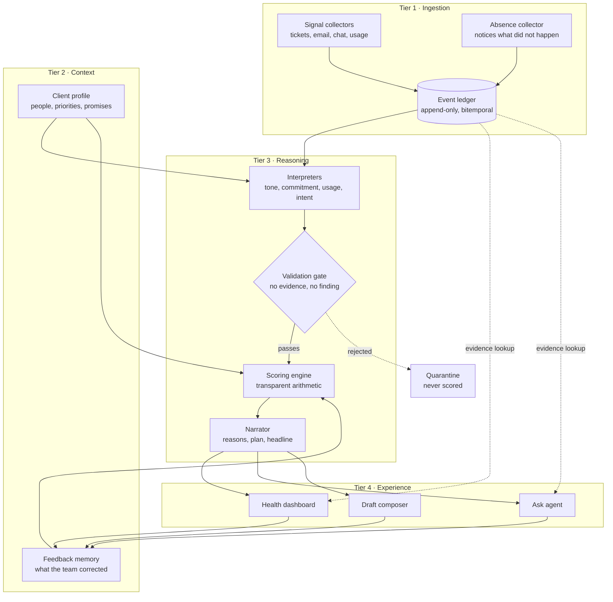

# Churn Prediction & Sentiment Agent
## Product Specification — v1.0

| | |
|---|---|
| **Document** | Product Specification (pre-build) |
| **Version** | 1.0 — Draft for review |
| **Date** | 7 August 2026 |
| **Original brief** | CS Studio — Churn Prediction & Sentiment Agent |
| **Status** | Ready for technical review |
| **Purpose** | Define what we are building and why, before any code is written |

---

## Table of contents

1. [Executive summary](#1-executive-summary)
2. [The problem](#2-the-problem)
3. [Users and scope](#3-users-and-scope)
4. [Product principles](#4-product-principles)
5. [Glossary](#5-glossary)
6. [Data](#6-data)
7. [Features by module](#7-features-by-module)
8. [The scoring model](#8-the-scoring-model)
9. [Architecture](#9-architecture)
10. [End-to-end walkthrough](#10-end-to-end-walkthrough)
11. [UI components](#11-ui-components)
12. [The agent](#12-the-agent)
13. [Limits and boundaries](#13-limits-and-boundaries)
14. [Success criteria](#14-success-criteria)
15. [Risks](#15-risks)
16. [Build order](#16-build-order)
17. [Open questions](#17-open-questions)

---

# 1. Executive summary

## What we are building

A dedicated monitoring agent for **one client relationship**. It reads the signals that already exist across email, chat, tickets and product usage, notices when the relationship is deteriorating, explains why with evidence, and proposes what to do next.

A human always decides and always sends.

## The one-sentence pitch

> The signals were always there, scattered across six systems and six people. This is the thing that reads them on Tuesday, instead of at the renewal.

## Why it is different

Most tools in this space detect sentiment: they read a message and label it positive or negative. That approach fails because a polite sentence from the person who signs the contract, about the feature the contract depends on, sixty days before renewal, is far more serious than an angry sentence from a junior user about a minor annoyance — and no sentiment model can tell them apart.

Our differentiator is **context**. Each deployment knows one client: who matters, what matters, what was promised, and how these particular people normally communicate. Severity is a function of that context, not of the words alone.

## The three things a user gets

1. **What is going wrong** with the relationship
2. **Why it matters**, with evidence they can click into
3. **What to do next**, with an owner and a deadline

---

# 2. The problem

## 2.1 What goes wrong today

Client frustration builds quietly and in pieces:

- A response time slips past what was promised
- A ticket is reopened for the second time
- The sponsor's emails get shorter and more formal
- The technical lead stops attending the weekly sync
- Product usage drifts down 20% over three weeks
- A satisfaction score drops from 9 to 6

Each of these is individually survivable and individually forgettable. Each is owned by a different person and lives in a different system. **Nobody is assigned to notice the shape of them together.**

The result is the renewal call that opens with *"we've been evaluating alternatives"* — where everything the client says was already in the vendor's own systems, weeks earlier.

## 2.2 Why nobody catches it

This is not a competence problem. Six people can each do their job correctly and the account still slips, because:

- Signals are **split across tools** with no shared view
- Signals are **split across time** — the pattern only exists across weeks
- The people who see them **change** (support agent on rotation, CSM on holiday)
- The most important signals are things that **did not happen**, and no system generates an alert for silence

Detecting patterns across time and systems is precisely the work humans are worst at and software is best at.

## 2.3 What "good" looks like

The team learns about the problem **three weeks earlier**, which is the difference between a phone call and a rescue. They walk into the conversation already knowing what the client was working up the courage to say.

---

# 3. Users and scope

## 3.1 Users

| User | What they need |
|---|---|
| **Customer Success lead** *(primary)* | Is this account safe? What needs me today? |
| **Support lead** | Which of my forty tickets actually matters? |
| **Account executive** | What do I need to know before the renewal call? |
| **Engineering manager** *(occasional)* | Is a technical issue damaging a commercial relationship? |

## 3.2 Scope

**One deployment serves one client company.** This is a deliberate constraint, not a limitation to remove later. It is what makes the context deep enough to be useful.

| In scope | Out of scope (v1) |
|---|---|
| One client relationship | Multi-client portfolio dashboard |
| Reading signals from connected sources | Writing to those sources |
| Producing a risk score with reasons | Automated actions of any kind |
| Drafting messages | Sending messages |
| Suggesting a plan | Executing a plan |
| Business-to-business account health | Individual consumer churn |

## 3.3 Explicit non-goals

- We are not building a helpdesk, a CRM, or a replacement for either
- We are not predicting cancellation probability
- We are not measuring the performance of individual employees
- We are not surfacing this tool or its scores to the client

---

# 4. Product principles

These are the commitments that shape every design decision. When a trade-off appears, these break the tie.

### P1 — Evidence or it does not exist
Every claim links to the actual email, ticket or message that produced it. A finding without evidence is discarded by the system before a human ever sees it.

### P2 — The model interprets, code calculates
Language models read language and write language. They never produce the number. All scoring is plain arithmetic that a person can verify on paper.

### P3 — Each component refuses to do the next one's job
Collectors do not judge. The ledger has no opinions. Readers do not rank. The calculator does not guess. This discipline is what makes the system explainable.

### P4 — A human always sends
There is no send capability anywhere in the product. Not disabled — absent.

### P5 — Admit what we cannot see
A score built on incomplete data must never look identical to a score built on complete data.

### P6 — Silence is a success state
When the client is healthy, the screen is nearly empty and says so. A tool that manufactures concern gets ignored.

### P7 — Context over sentiment
Who said it and what it was about matters more than how it was phrased.

---

# 5. Glossary

Shared vocabulary for the whole team. Use these words precisely.

| Term | Meaning |
|---|---|
| **Signal** | Anything observable from a connected source |
| **Event** | One recorded fact in the ledger — a message, a state change, a measurement |
| **Envelope** | The standard wrapper a collector puts around a raw signal |
| **Finding** | A structured observation produced by a reader, e.g. "tone shifted, moderate, 80% confident" |
| **Issue** | A group of findings that share one underlying cause |
| **Client profile** | The hand-authored context card: people, priorities, promises |
| **Score** | 0–100 severity aggregate, recalculated from scratch every run |
| **Band** | Healthy / Watch / At risk |
| **Trace** | The clickable path from a number back to the original message |
| **Baseline** | How a person or metric normally behaves, drawn from a healthy period |
| **Coverage** | What the system could and could not see during a window |

---

# 6. Data

## 6.1 Sources

| Source | Examples | Signals extracted |
|---|---|---|
| **Tickets** | Zendesk, Jira, Intercom | Response times, reopens, priority, ageing, who filed |
| **Email** | Gmail, Microsoft 365 | Message content, participants, threading, timing |
| **Chat** | Slack Connect, Teams | Message rhythm, reactions, channel activity |
| **Product usage** | Warehouse / telemetry | Feature activity vs normal |
| **Surveys** | CSAT, NPS | Score plus written comment |
| **Meetings** | Calendar, transcripts | Attendance, participation, verbal commitments |
| **CRM / contracts** | Salesforce, contract store | Renewal date, contract value, agreed commitments |

## 6.2 The client profile

Hand-authored before first use, versioned like code, and the single most important input in the product.

```yaml
client: Meridian Logistics
renewal_date: 2026-05-08
contract_value_band: strategic

business_goals:
  - reduce delivery disputes by 30% this year

stakeholders:
  - id: stk_ana
    name: Ana Reyes
    role: CTO
    influence: sponsor        # multiplier 1.6
    signs_renewal: true
    identifiers: [ana.reyes@meridian.com, "@ana"]
  - id: stk_diego
    name: Diego Marín
    role: Dev lead
    influence: daily_user     # multiplier 1.2
    identifiers: [diego@meridian.com, user_8823]

product_areas:
  - key: tracking_api
    criticality: critical     # multiplier 1.5
  - key: reporting
    criticality: standard     # multiplier 1.0

commitments:
  - type: first_response
    priority: P1
    threshold_business_hours: 4

communication:
  working_hours: 08:00-18:00
  timezone: America/Bogota
  languages: [es, en]
  norms: >
    Direct communicators. Brevity is habitual, not hostile.
    Formality rises when senior people are present.

exclusions:
  - legal_threads
  - commercial_negotiation

history:
  - date: 2026-03-02
    event: major outage, improvement plan agreed
```

## 6.3 Data we deliberately do not collect

- Threads listed in `exclusions` (legal, HR, commercial negotiation)
- Anything requiring write access to a source system
- Individual employee performance data
- Meeting recordings without documented consent from all parties

## 6.4 Privacy and security

| Requirement | Approach |
|---|---|
| **Sensitive data** | Redacted at the collector, before storage; redactions recorded |
| **Encryption** | Message bodies encrypted at rest, keys scoped per deployment |
| **Access** | Read-only, narrowest available scopes, documented per source |
| **Deletion** | Crypto-shredding — destroy keys, keep the event skeleton so score history survives |
| **Retention** | Message bodies expire on a schedule; findings and scores persist |
| **Isolation** | One deployment, one client, one key set — no shared storage |
| **Audit** | Append-only ledger with hash chaining for tamper evidence |

---

# 7. Features by module

Ten modules, in four tiers. Each has one job and is forbidden from doing the next one's.

## Tier 1 — Ingestion

### M1 · Signal collectors
**Job:** get material out of source systems and onto the ledger, without interpreting it.

- One adapter per source, all implementing the same interface
- Hybrid sync: webhooks for speed, scheduled polling for correctness
- Deliberate overlap window on every fetch; duplicates removed by idempotency key
- **Identity resolution**: map addresses and user IDs to profile stakeholders; unresolved is a valid state, never a guess
- **Absence collector**: a scheduled adapter that emits events when expected contact does *not* happen
- **Coverage report**: every run reports what it could not see, and why

**Forbidden:** assigning severity, filtering by importance, knowing what any product area means.

### M2 · Event ledger
**Job:** one append-only timeline that is the single source of truth.

- Nothing is updated or deleted; corrections are new events that supersede old ones
- **Two timestamps on every event**: when it happened, and when we learned it — this is what allows honest replay of any past date
- Thread stitching across channels (email → ticket → chat), with confidence recorded
- Derived projections (timeline, per-person rollups, response pairs) are rebuildable by replay
- **Response pairs** measured in business hours, against the client's working calendar

**Forbidden:** storing any judgment. "19 hours elapsed" belongs here; "the promise was broken" does not.

## Tier 2 — Context

### M3 · Client profile
**Job:** the lens that converts a signal into a severity.

- Structured, versioned, human-authored
- Supplies the `influence` and `criticality` multipliers used in scoring
- Supplies communication norms and working calendar to the readers
- Every scoring run records which profile version it used

### M4 · Feedback memory
**Job:** remember what the team said we got wrong.

- Any card can be marked **correct / false alarm / resolved**
- Matching patterns are damped in future runs
- The damping is shown on screen: *"weight reduced — your team dismissed this pattern twice"*
- No retraining, no fine-tuning. Learning the user can read

## Tier 3 — Reasoning

### M5 · Interpreters (the readers)
**Job:** turn raw material into structured findings. Each reader answers exactly one question.

| Reader | Type | Question |
|---|---|---|
| Commitment | Code | Did a response exceed what we promised, in business hours? |
| Usage | Statistics | Has activity deviated beyond normal variance? |
| Recurrence | Clustering | Is this the same problem returning? |
| Absence | Statistics | Is expected contact missing? |
| Relationship | Graph diff | Has the cast of people changed? |
| **Tone** | **LLM** | Is this person writing differently *than they normally do*? |
| **Intent** | **LLM** | Are there escalation, competitive or contractual phrases? |
| **Meeting** | **LLM** | What did we verbally promise, and by when? |

Key rules:
- Tone is **baseline-relative**, never absolute sentiment. The baseline is frozen at a human-confirmed healthy period
- `magnitude` and `confidence` are separate fields — a small certainty is not a large guess
- **Abstention is a first-class output.** No history, no opinion
- Every finding cites the event IDs it came from

### M5a · Validation gate
**Job:** reject anything unproven, before it can reach the score.

Four checks: schema valid → cited events exist in the supplied window → enough evidence for the finding type → confidence above the floor. Failures are quarantined, never repaired, and become the evaluation dataset.

### M6 · Scoring engine
**Job:** findings in, number out. Deliberately unintelligent. See [section 8](#8-the-scoring-model).

### M7 · Narrator
**Job:** turn the calculated facts into sentences a human wants to read.

- Receives findings **already ranked** — it never decides what matters
- Produces: headline, reasons with evidence, prioritised actions with owners and dates
- Actions come from a human-written **playbook**, personalised by the model — not invented
- **No new facts**: every number and name in its output must already exist in its input, checked mechanically

## Tier 4 — Experience

### M8 · Health dashboard
Ambient awareness. Answers one question: *does anything need me today?* Calculates nothing — everything is precomputed. See [section 11](#11-ui-components).

### M9 · Ask agent
The question box. Answers by **building UI components**, not paragraphs. Looks facts up; never recalculates the score. See [section 12](#12-the-agent).

### M10 · Draft composer
Writes the client-facing message. Opens beside the evidence. Offers tone variants. **No send button exists.**

---

# 8. The scoring model

## 8.1 One finding's weight

```
points = base × influence × criticality × confidence × magnitude × recency × damping
```

| Term | Source | Example |
|---|---|---|
| `base` | Config, per finding type | Broken response promise = 20 |
| `influence` | Profile | Sponsor 1.6, daily user 1.2, unknown 0.8 |
| `criticality` | Profile | Critical area 1.5, standard 1.0, peripheral 0.6 |
| `confidence` | The finding | 0.8 for an 80%-confident reader |
| `magnitude` | The finding | How large the change was |
| `recency` | Time + resolution state | See 8.3 |
| `damping` | Feedback memory | ≤ 1.0 |

## 8.2 Grouping — one problem, not five

A single broken feature typically produces four or five findings. Adding them all would count one incident many times, and would rank a loud single problem above three separate ones.

So findings are clustered into **issues**, and within each issue contributions diminish:

| Position in issue | Counted at |
|---|---|
| Largest | 100% |
| Second | 60% |
| Third | 36% |
| Fourth | 22% |

Across different issues, everything counts fully. **Breadth is not discounted; repetition is.**

## 8.3 Time

| State | Behaviour |
|---|---|
| **Resolved** | Fades on a per-type half-life |
| **Open** | Does not fade at all |
| **Open and overdue** | Gains an ageing multiplier |

This is the single most important rule about time. Blanket decay would cause the score to *fall* during the exact period a broken promise is doing the most damage.

## 8.4 Positive signals

Milestones met, successful reviews, active champions and executive engagement subtract points — **capped at 25% of accumulated negative severity.** Goodwill buys patience; it does not undo damage.

## 8.5 Points to score

```
score = 100 × (1 − e^(−points / 33))
```

| Points | Score |
|---|---|
| 10 | 26 |
| 25 | 53 |
| 49 | 78 |
| 80 | 91 |
| 150 | 99 |

A saturating curve: steep where discrimination matters, flat at the top. It never reaches 100, so a bad situation always has room to get worse.

## 8.6 Bands and stickiness

| Band | Enter at | Leave at |
|---|---|---|
| Healthy | below 35 | — |
| Watch | 35 | — |
| At risk | 65 | falls below 55 |

The gap between 65 and 55 is **hysteresis** — it stops the label flipping when the score wobbles. Band changes also require the score to hold across two consecutive runs. Escalation may be fast; de-escalation is deliberately slow.

## 8.7 History

**The previous score is never an input to the calculation.** Every run starts from zero and recalculates from all evidence that is still true.

Why: if the score built on itself, it could never fall when problems are fixed, and any error would persist forever.

History is stored, and used for four other things:

| Use | Needs history? |
|---|---|
| Calculating the score | No |
| Showing the trend | Yes — display only |
| Deciding when to notify | Yes |
| Applying band stickiness | Yes |
| Proving lead time and measuring changes | Yes |

## 8.8 Renewal proximity is kept out of the score

Multiplying risk by renewal proximity would make the score climb with the calendar even when nothing changed, corrupting the trend line.

Instead: **Risk** = state of the relationship (only evidence moves it). **Stakes** = renewal proximity and contract value. They are multiplied for *prioritisation* and displayed as separate facts.

## 8.9 When the score recalculates

| Trigger | Latency |
|---|---|
| New event arrives | ~40 seconds end to end |
| Burst of events | Batched in a 30-second window, one update |
| Urgent phrase detected | Immediate, skips the batch window |
| Scheduled heartbeat | Hourly — because time itself changes the answer |
| Profile or weights edited | Full replay |

### Behaviour during quiet periods

| Situation | Score behaviour |
|---|---|
| Quiet, nothing pending | Drifts slowly down as fixed issues fade |
| Quiet, we owe a reply | **Climbs daily** — the promise ages |
| Quiet, the client has gone silent | **Jumps** when the absence threshold is crossed |
| Quiet because a source is broken | **Frozen**, with a visible warning banner |

---

# 9. Architecture

## 9.1 Diagram



## 9.2 Component responsibilities

| Component | Owns | Must never |
|---|---|---|
| Signal collectors | Fetching, normalising, identity | Judge importance |
| Absence collector | Detecting non-occurrence | Decide silence is bad |
| Event ledger | The single source of truth | Store an opinion |
| Client profile | Severity multipliers, norms | Contain scoring logic |
| Feedback memory | Damping weights | Retrain a model |
| Interpreters | Structured findings | Rank findings |
| Validation gate | Rejecting unproven claims | Repair bad output |
| Scoring engine | The number | Call a model |
| Narrator | Readable explanation | Add a fact |
| Dashboard | Display | Calculate |
| Ask agent | Lookup and rendering | Recalculate the score |
| Draft composer | Client-facing text | Send anything |

## 9.3 The three loops

**Sense loop (continuous)** — collectors → ledger → interpreters → score → dashboard. Runs on events and on a schedule.

**Ask loop (on demand)** — question → intent → ledger query → rendered card. Never recomputes the score; explains the one that exists.

**Learning loop (human-driven)** — any card → verdict → feedback memory → damped weights on the next sense run.

## 9.4 Non-functional requirements

| Requirement | Target |
|---|---|
| Dashboard load | < 1s (pure database read) |
| Event to updated score | < 60s |
| Ask agent response | < 3s |
| Interpretation | Once per message, cached forever |
| Availability | Degraded operation on partial source failure, never all-or-nothing |
| Determinism | Same ledger + same versions → identical score, always |
| Scale | ~50k–200k events/year per deployment — a relational database is sufficient |

**Deliberate simplicity:** the architecture is event-sourced in shape, not in tooling. Append-only, bitemporal and replayable are properties of the schema and the discipline, not of a message broker.

---

# 10. End-to-end walkthrough

One email, from arrival to screen.

| Time | Component | What happens |
|---|---|---|
| 09:14:02 | — | Ana (CTO) sends: *"Please advise on the timeline. I need to brief the board on Thursday."* |
| 09:14:03 | Collector | Fetches, resolves Ana to `stk_ana`, notes an unresolved new participant |
| 09:14:04 | Ledger | Appended. Response clock opens. Rollup updates: 14 words vs a 47-word baseline; no greeting vs 11-of-12 |
| 09:14:05 | — | Only the affected windows are queued for re-reading |
| 09:14:38 | Tone reader | Deteriorating, magnitude 0.6, confidence 0.8, five events cited |
| 09:14:38 | Intent reader | Escalation language: board briefing, stated deadline |
| 09:14:39 | Validation gate | Both pass. A third finding citing a non-existent event is **quarantined** |
| 09:14:39 | Scoring engine | Recalculates from zero across all live findings |
| 09:14:40 | Narrator | Writes the headline, reasons and plan |
| 09:14:40 | Dashboard | **78 · At risk · up 12**, with five clickable reasons |

### The arithmetic behind 78

**Issue A — tracking tool** (slow reply 27.0 + reopened 14.4 at 60% + usage 9.5 at 36%) = **39.0**
**Issue B — people** (Ana's tone 9.2 + Diego's silence 8.6 at 60%) = **14.4**
**Positive** — milestone met = **−4.0**

`39.0 + 14.4 − 4.0 = 49.4 points → score 78`

### One week later

The ticket is fixed, Marta called Ana, Diego is still silent.

`26.4 + 10.8 − 6.0 = 31.2 points → score 61`

The score falls by 17, but the band **stays At risk** because 61 is above the 55 exit threshold. And Diego — unchanged, unresolved, unfaded — automatically becomes the top concern.

---

# 11. UI components

## 11.1 Design direction

**Clinical calm, not red alert.** Near-white canvas, hairline borders, generous space. One accent colour, used only for risk. The client's own words rendered in a serif face so they read as quotes, not log lines. No gauges, no speedometers, no pulsing alarms.

The quieter the interface, the more serious the number feels.

## 11.2 Screen inventory

| Screen | Purpose |
|---|---|
| **Health dashboard** | The default view. Answers "does anything need me today?" |
| **Evidence trace panel** | Opens from any number. Shows the proof |
| **Ask thread** | Question box and rendered answers |
| **Draft composer** | Message editing beside its evidence |
| **Profile editor** | Maintaining the client context card |
| **System health** | Sources, coverage, quarantine |

## 11.3 Dashboard components

| Component | Contents | States |
|---|---|---|
| **Client header** | Name, band pill, days to renewal | Healthy / Watch / At risk |
| **Score block** | Number, trend, sparkline | Normal / Learning / Stale |
| **Contribution bars** | Each cause with its points; positives in green | Empty when healthy |
| **Pulse timeline** | Recent events in order, severity dot, quoted text | Empty / Filtered |
| **Stakeholder cards** | Person, role, tone trajectory, last seen | Active / Quiet / Unresolved identity |
| **Coverage line** | *"Reading 4 of 5 sources · complete to 09:12"* | OK / Degraded / Disconnected |
| **Ask bar** | Always present, bottom of screen | Idle / Thinking / Answered |

## 11.4 The evidence trace panel

The most important component in the product. Opens from any number and contains:

1. **Header** — the finding name and its point value
2. **Side-by-side comparison** — how this person normally behaves, next to how they behave now
3. **What changed** — observable features only, never emotions
4. **The messages** — the actual quoted evidence, timestamped and attributed
5. **The arithmetic in words** — *"base 12, doubled because Ana signs the renewal, reduced because the reader was 80% confident"*
6. **Feedback controls** — correct / false alarm / resolved

Two design rules: the comparison is shown rather than summarised, and the maths is written in plain sentences. Once a user verifies the arithmetic themselves, they stop questioning the score and start using it.

## 11.5 States that must be designed, not improvised

| State | Message |
|---|---|
| **Healthy** | *"Nothing needs you today. Last checked 4 minutes ago."* |
| **Learning** | *"Still learning — 3 of 6 signal types available."* |
| **Source down** | *"Email hasn't been read since Tuesday — reconnect."* |
| **Catching up** | *"Partial data — 40 minutes behind."* |
| **Unresolved person** | *"Someone at meridian.com has written 3 times and isn't in the profile. Who is this?"* |

The healthy state matters most. A tool that manufactures mild concern on quiet weeks gets ignored on the week that counts.

## 11.6 Interaction details

- The score **animates from its previous value**, so the movement tells the story
- Client words are always serif and quoted; system words are always sans-serif
- Nothing turns red until a promise is broken or a sponsor disengages; amber covers drift
- Feedback controls live on every card, one click, no modal, no confirmation toast
- Every number is a door — one click to the reason, one more to the source message

## 11.7 What must not be built

Ticket volume charts, per-message sentiment lines, monthly sentiment averages, category pie charts, and any percentage that would not change a decision.

**The test:** if this number changed, would anyone do something different? If not, cut it.

---

# 12. The agent

The agent has three faces sharing one brain.

## 12.1 The narrator (explains)

Turns the calculated breakdown into readable sentences.

| Weak | Strong |
|---|---|
| "Negative sentiment detected" | "Ana stopped greeting us — and she signs the renewal" |
| "SLA performance degraded" | "We took 19 hours to reply. We promised 4." |
| "Multiple risk factors present" | "One broken feature is behind four of the five warning signs" |

Pattern: **a person, a number, and why it matters here.**

Actions come from a human-written playbook and are personalised with real names, tickets and dates. Every action has an **owner** and a **when**. An action without an owner is a wish.

## 12.2 The ask agent (answers)

Answers by choosing and populating a UI component, not by writing prose.

| Question | Component built |
|---|---|
| Why did the score go up? | Delta breakdown with per-cause points and traces |
| Is this normal for Ana? | Baseline vs current comparison |
| Who's gone quiet? | Stakeholder cards with last-seen |
| What's the top risk? | Ranked issue list |
| What should we do? | Action checklist with owners and dates |
| What did we promise them? | Commitments and their status |
| Show me everything about X | Filtered timeline |
| Write to Ana about this | Hands off to the composer |

A deliberately small menu answers roughly 90% of real questions well. Anything else falls back to plain text, clearly marked, with sources attached.

**Honest answers it must be comfortable giving:** *"I'm not sure what you mean"*, *"that source isn't connected"*, and *"I can't tell you that."*

**Questions it declines:**
- **Predictions** — "will they cancel?" It describes today, it does not forecast
- **Judgments about colleagues** — it can state that a ticket sat 19 hours; it will not build a case against an individual. The moment it does, people hide work from it and the data dies
- **Character assessments** of anyone at the client

## 12.3 The draft composer (writes)

**Given:** the top issue and its evidence, the client's communication preferences, the real thread history, and what the team has actually agreed to do.

**Craft rules:**
- Acknowledge specifically and first — *"we took 19 hours; we promised 4"* beats *"sorry for any inconvenience"*
- One ask per message
- Match their rhythm — short people get short messages
- Do not grovel
- Sometimes the right output is *"call, don't email"*, plus talking points

**Never writes:** blame, invented dates or causes, discounts or commercial concessions, or **any mention that the client is being monitored or scored**.

**Automatic checks before display:** every fact exists in the evidence; no dated promises unless a human supplied one; nothing internal leaks; no other client is ever mentioned.

**After the human sends,** the message returns through the collectors into the ledger, closing the response clock and letting the system observe whether its own suggestion worked.

## 12.4 Where AI is and is not used

| Function | AI? |
|---|---|
| Collecting, storing, timing, counting | No |
| Commitment, usage, absence, relationship readers | No |
| Recurrence clustering | Embeddings only |
| **Tone, intent and meeting readers** | **Yes** |
| Validation gate, scoring engine | No |
| **Narrator, ask agent, draft composer** | **Yes** |

> **The AI reads language and writes language. It never counts, never scores, and never sends.**

## 12.5 Model safety

- **Structured output everywhere.** Every model call returns a schema; prose is generated once, at the end
- **Prompt injection defence is architectural.** Client text is untrusted data. Interpreters have no tools and no side effects, output is validated against closed enumerations, and findings can never become instructions
- **Confidence is first-class.** Low-confidence findings render as "possible" and contribute a fraction of their weight
- **Versioned prompts.** Changing a prompt is a replayable, measurable event, never an untracked string edit

---

# 13. Limits and boundaries

## 13.1 Hard product boundaries

1. One deployment serves **one client company**
2. The system **never sends** anything to anyone
3. Human review is required for every recommendation and every message
4. The score is a **transparent risk estimate**, not a prediction of cancellation
5. The client is never told they are being scored
6. The score is **never used for individual performance management**

Boundary 6 deserves a written policy. The moment this becomes a stick, tickets get closed prematurely, difficult conversations move to channels we cannot see, and the data quality collapses. It is a diagnostic instrument; instruments only work when nobody is incentivised to bend the needle.

## 13.2 Honest limitations

| Limitation | Mitigation |
|---|---|
| Needs history before it can judge tone | Explicit "still learning" state |
| Cannot see phone calls or in-person conversations | Coverage line states what is connected |
| Cannot know a client's internal politics | Profile captures what the team knows; the rest is acknowledged as unknown |
| A determined client could write performatively | Behavioural signals (usage, attendance, participants) are harder to fake than words |
| Findings are correlational, not causal | Language throughout describes what changed, never why |

## 13.3 Anti-goals in the interface

No leaderboards. No account rankings. No "engagement scores" for staff. No client-visible outputs.

---

# 14. Success criteria

## 14.1 Demo success (the original brief)

A strong demo makes three things clear:

1. What is going wrong with the relationship
2. Why it matters, given this client's context and evidence
3. What the team should do next

## 14.2 Product success

| Measure | Target |
|---|---|
| **Lead time** | Risk surfaced ≥ 2 weeks before the team would have escalated |
| **Precision** | ≥ 70% of At-risk alerts confirmed as real by the team |
| **Trust** | ≥ 60% of alerts opened through to evidence — users check, and keep checking |
| **Quiet weeks are quiet** | < 1 interruption per week when the account is healthy |
| **Action rate** | ≥ 50% of proposed actions accepted or edited, not ignored |
| **Draft usefulness** | ≥ 40% of drafts sent after light editing |

## 14.3 Engineering acceptance criteria

- Running any collector twice produces no duplicates
- Dropping all projections and replaying reproduces the current dashboard exactly
- No finding reaches the score without validated evidence IDs
- Score contributions reconcile to the total, to the decimal
- Adding a negative finding never lowers the score
- A score with a degraded source is visually distinguishable from a complete one
- No model call exists anywhere in the scoring engine

---

# 15. Risks

| Risk | Impact | Mitigation |
|---|---|---|
| **False alarms erode trust** | High | Confidence multipliers, abstention paths, hysteresis, feedback damping |
| **Silent data loss** | High | Coverage reporting, staleness banners, frozen scores on outage |
| **Baseline drift** | Medium | Baseline frozen at a human-confirmed healthy period |
| **Goodhart's law** | High | Reopen weighted above close; explicit no-performance-management policy |
| **Prompt injection** | Medium | Data/instruction separation, no tools in interpreters, closed enums |
| **Over-notification** | High | Band changes only, daily digest otherwise, no weekend alerts |
| **Model hallucination** | High | Evidence membership check — structurally impossible to score an uncited claim |
| **Scope creep to multi-client** | Medium | The single-client constraint is a product decision, documented here |

---

# 16. Build order

Each phase leaves a working system. Nothing is ever half-wired.

| Phase | Deliverable | Why this order |
|---|---|---|
| **1** | Event ledger + client profile | Unglamorous and foundational. Auditability cannot be added later |
| **2** | Scoring engine with hand-written findings | Proves the number before any AI exists |
| **3** | Deterministic interpreters (commitment, usage, recurrence, absence) | Real findings, no model risk |
| **4** | Dashboard with the evidence trace | The moment it stops being a script and becomes a product |
| **5** | Model interpreters (tone, intent) + validation gate | Adds judgment, safely fenced |
| **6** | Narrator + ask agent | The explanation layer |
| **7** | Draft composer | The closer |
| **8** | Feedback memory | Only once 1–7 are solid |

**Phase 2 is the checkpoint.** If the score cannot be explained and defended with hand-written findings, no amount of AI will fix it.

---

# 17. Open questions

Decisions needed before build starts.

| # | Question | Owner | Needed by |
|---|---|---|---|
| 1 | Which source systems for the first deployment? | Product + client | Phase 1 |
| 2 | Who authors and maintains the client profile? | CS lead | Phase 1 |
| 3 | Are meeting transcripts in scope, and is consent documented? | Legal | Phase 3 |
| 4 | Base weights — who runs the elicitation workshop with CS leads? | Product | Phase 2 |
| 5 | Retention period for message bodies? | Legal + client | Phase 1 |
| 6 | Where do notifications land — email, Slack, or in-app? | CS lead | Phase 4 |
| 7 | Who signs off the playbook of standard actions? | CS lead | Phase 6 |
| 8 | Do we display the score to the account executive, or only to CS? | Product | Phase 4 |

---

## Appendix A — Design commitments, in one page

Pin this where the team can see it.

1. Evidence or it does not exist
2. The model interprets; code calculates
3. Each component refuses to do the next one's job
4. A human always sends
5. Admit what we cannot see
6. Silence is a success state
7. Context over sentiment
8. The score describes today's evidence, not yesterday's opinion
9. Unresolved problems never fade
10. If a number would not change a decision, do not show it

---

*End of document — v1.0*
