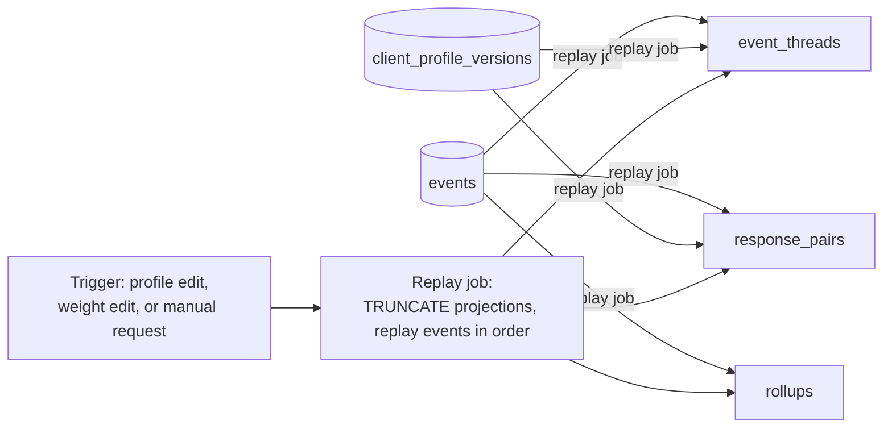

# 01 · Database overview

| | |
|---|---|
| **Engine** | PostgreSQL 16 (per `architecture/03-technology-stack.md`) |
| **Tenancy** | One schema (or database) per client deployment — no cross-tenant tables, ever |
| **Scale target** | 50k–200k events/year per deployment |

**New to this schema? Read `examples/01-end-to-end-walkthrough.md` first.** It walks five real signals through every table listed below, in order, with actual example rows and plain-English explanations of what each one is for. This document (`01`–`10`) is the reference; that one is the story.

**In one sentence:** the whole database is built around one rule — *facts are permanent, opinions are derived, and every opinion has to point back at the facts that produced it.* Everything else below is that rule worked out table by table.

## Design principles

1. **Append-only where it matters.** The `events` table (and `findings`, `score_runs`, `feedback_verdicts`) are insert-only. No application code path issues `UPDATE`/`DELETE` against them; this is enforced by revoking those grants from the application's database role.
2. **Bitemporal.** Every ledger row carries both `occurred_at` (when it happened in the source system) and `recorded_at` (when the ledger learned of it), so the system can honestly answer "what did we know on date X."
3. **Replayable.** Projection tables (`rollups`, `event_threads`, `response_pairs`) are derived data — they can be truncated and rebuilt from `events` alone. They are marked `-- PROJECTION (rebuildable)` in the DDL comments.
4. **Versioned context.** `client_profile_versions` is append-only; a scoring run always records the exact version it used, never "the current profile."
5. **Decimal-exact reconciliation.** `score_contributions` stores the literal arithmetic terms (base, influence, criticality, confidence, magnitude, recency, damping) per finding so the total can be reconciled to the decimal (spec §14.3).
6. **No opinions in the ledger.** `events` stores only observed facts. Judgments live exclusively in `findings` (Tier 3), never in Tier 1 tables.
7. **Crypto-shreddable.** Message bodies are stored encrypted (`bytea` + a per-deployment data key reference — a `.env`-scoped key file in Phase 1, a cloud KMS-wrapped key in Phase 2, see `architecture/03-technology-stack.md` and `decisions/00-open-questions-resolved.md` Q5); deleting the key renders the body permanently unrecoverable while the row (and therefore score history) survives.

## Schema groups

| File | Tables | Maps to |
|---|---|---|
| `02-schema-ingestion.md` | `sources`, `collector_runs`, `coverage_reports`, `identity_map`, `raw_envelopes` | M1 |
| `03-schema-ledger.md` | `events`, `event_threads`, `response_pairs`, `rollups` | M2 |
| `04-schema-context.md` | `client_profile_versions`, `stakeholders`, `product_areas`, `commitments`, `profile_history_entries` | M3 |
| `05-schema-reasoning.md` | `findings`, `issues`, `finding_issue_map`, `quarantine`, `validation_failures` | M5, M5a |
| `06-schema-scoring.md` | `score_runs`, `score_contributions`, `band_history` | M6 |
| `07-schema-feedback.md` | `feedback_verdicts`, `damping_weights` | M4 |
| `08-schema-experience.md` | `narrator_outputs`, `ask_queries`, `draft_messages`, `notifications` | M7, M8, M9, M10 |
| `09-erd-full.md` | Consolidated ER diagram of all tables above | — |
| `10-ddl-appendix.md` | Runnable `CREATE TABLE` statements for every table | — |

## Naming conventions

- Table names: plural, `snake_case`.
- Primary keys: `id UUID DEFAULT gen_random_uuid()`.
- Foreign keys: `<referenced_table_singular>_id`.
- Every table that is an audit/evidence source carries `created_at TIMESTAMPTZ NOT NULL DEFAULT now()`.
- Enum-like columns use Postgres `CHECK` constraints or native `ENUM` types (documented per table) — never free-text status columns, matching the "closed enumerations" discipline from `architecture/04-ai-safety-and-model-usage.md`.

## How projections are rebuilt

Truncating `event_threads`, `response_pairs`, and `rollups` and re-running the replay job against `events` (in `occurred_at` order) must reproduce byte-identical projection state — this is the mechanical test behind REQ-NFR-09 / REQ-NFR-28.
