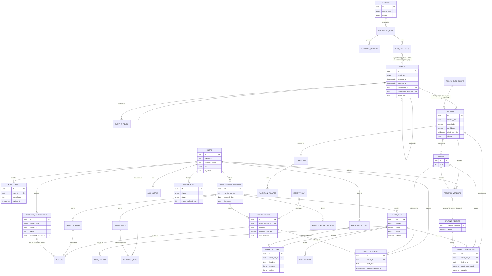

# 09 · Entity-relationship diagram — full schema

Consolidated view of every table defined in `02-schema-ingestion.md` through `08-schema-experience.md`.

## Reading notes

- `EVENTS ||--o{ FINDINGS` is drawn as one-to-many for diagram simplicity; the real relationship is many-to-many via `findings.cited_event_ids UUID[]` (a finding cites several events, an event can support several findings). See `05-schema-reasoning.md`.
- `DRAFT_MESSAGES` has no relationship line to any outbound-transport entity — none exists in this schema (REQ-M10-P1).
- `FINDINGS ||--o| QUARANTINE` is a real 1-to-0-or-1 relationship, not just a diagram convention — `quarantine.finding_id` carries a `UNIQUE` constraint in the DDL, so a finding cannot be quarantined twice.
- `RAW_ENVELOPES }o--o| EVENTS` is optional on the events side — not every raw envelope becomes an event (some are rejected before reaching the ledger), matching `raw_envelopes.ledger_event_id` being nullable.
- `USERS` is the identity behind every "who did this" column in the schema (`data-base/12-users-and-auth.md`) — before this table existed, those columns were free text with no real referential integrity.
- Full column lists live in `02`–`08` and `12`; this diagram shows primary keys, foreign keys, and the columns most relevant to the product's core guarantees (evidence citation, damping, hysteresis, no-send, identity).
