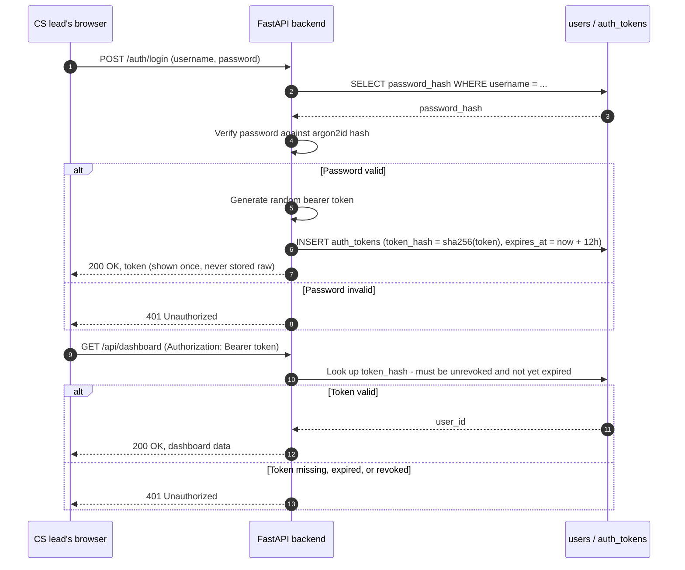

# 12 · Schema — Users & authentication

Backs `requirements/14-authentication.md`. These two tables are new in this revision and are the reason four other tables in this database (`client_profile_versions.authored_by`, `playbook_actions.signed_off_by`, `feedback_verdicts.submitted_by`, `ask_queries.asked_by`) went from free-text strings to real foreign keys — see each file's changelog note.

**Why this schema exists, in plain terms:** before this table existed, "who did this?" was answered with a plain-text string like `"cs.lead@vendor.com"` — readable, but not actually *anyone* the database could verify, join against, or revoke access for. This schema makes "who" a real, checkable identity everywhere the product records a human decision.

## `users`

**In plain terms:** one row per person who can log in. `role` is now enforced (specs/011-production-hardening, User Story 2/4) for two of its five values: `account_executive` gets read-only access (every mutating endpoint 403s via `require_full_access`), and `admin` is the only role that can PATCH a finding type's weight (`require_admin`). The other three roles (`cs_lead`, `support_lead`, `engineering_manager`) still see and do everything else the product offers — full RBAC across all five roles remains a later hardening step.

| Field | Type | Description |
|---|---|---|
| `id` | UUID PK | |
| `username` | TEXT UNIQUE | |
| `password_hash` | TEXT | Argon2id hash — the raw password is never stored, never logged, never recoverable (REQ-AUTH-02) |
| `display_name` | TEXT | Shown on cards ("Marta" in the draft-composer example, `examples/01-end-to-end-walkthrough.md` §13) |
| `role` | ENUM(`cs_lead`,`support_lead`,`account_executive`,`engineering_manager`,`admin`), NULL | Enforced for `account_executive` (read-only, `require_full_access`) and `admin` (weight recalibration, `require_admin`); informational for the other three (REQ-AUTH-05) |
| `is_active` | BOOLEAN | A deactivated user's existing tokens are still revoked via `auth_tokens.revoked_at` — deactivating never deletes the row (audit trail preserved) |
| `created_at` | TIMESTAMPTZ | |
| `last_login_at` | TIMESTAMPTZ, NULL | |

**Example row** — the CS lead referenced throughout this documentation set:

| id | username | display_name | role | is_active |
|---|---|---|---|---|
| `usr-marta` | `marta` | Marta | `cs_lead` | **true** |

## `auth_tokens`

**In plain terms:** the record of every bearer token ever issued, so a token can be checked and revoked without trusting the client to tell the truth about who it is. Matches the "username/password login, token for subsequent requests" flow in `architecture/07-api-spec.md`.

| Field | Type | Description |
|---|---|---|
| `id` | UUID PK | |
| `user_id` | UUID FK → `users.id` | |
| `token_hash` | TEXT UNIQUE | SHA-256 of the actual bearer token — the raw token exists only in the HTTP response at issuance time and in the client's memory afterward; the database never holds it in reversible form (REQ-AUTH-03) |
| `issued_at` | TIMESTAMPTZ | |
| `expires_at` | TIMESTAMPTZ | Every token has a hard expiry — there is no such thing as a permanent token in this schema |
| `revoked_at` | TIMESTAMPTZ, NULL | Set on logout or on manual revocation; a request presenting a revoked token is rejected even if `expires_at` hasn't passed yet |

**Example row:**

| user_id | token_hash | issued_at | expires_at | revoked_at |
|---|---|---|---|---|
| `usr-marta` | `sha256(...)` | 2026-08-11 08:55 | 2026-08-11 20:55 | *(null)* |

## How login works, end to end

## What this does *not* do yet (Post-MVP)

- **Only two roles are enforced.** `account_executive` (read-only) and `admin` (weight recalibration) are gated (specs/011-production-hardening); `cs_lead`/`support_lead`/`engineering_manager` still reach every endpoint identically. Broader per-role scoping across all five remains a later hardening step.
- **No SSO/OAuth.** Username/password only, per the explicit MVP scope for this module.
- **No password reset flow, no MFA.** Both are reasonable Post-MVP hardening steps, not required for the first solution to be internally usable and demoable.

## Notes

- Every table in this database that previously stored a free-text "who did this" string now stores `<x>_user_id UUID REFERENCES users(id)` instead: `client_profile_versions.authored_by_user_id`, `playbook_actions.signed_off_by_user_id`, `feedback_verdicts.submitted_by_user_id`, `ask_queries.asked_by_user_id`, `draft_messages.requested_by_user_id`, `baseline_confirmations.confirmed_by_user_id`, `replay_runs.triggered_by_user_id`.
- `password_hash` and `token_hash` are the only two secret-adjacent columns in this entire schema that aren't message-body encryption — they're irreversible hashes, not encrypted values, so there is no `data_key_ref` for them and no crypto-shredding concern.
