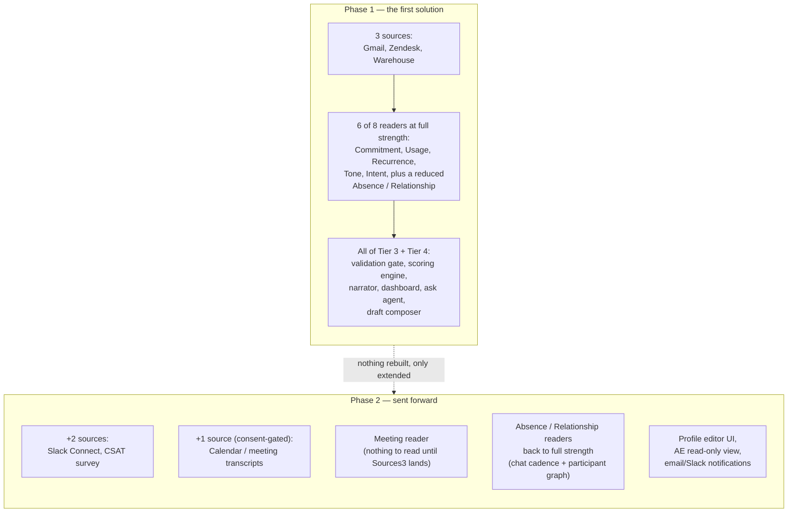

# 01 · MVP scope and phasing — the limits of the first solution

| | |
|---|---|
| **Document** | Scope boundary — what Phase 1 builds, what it deliberately sends to Phase 2 |
| **Status** | Approved for Phase 1 build start |
| **Date** | 2026-08-10 |
| **Depends on** | `decisions/00-open-questions-resolved.md` |

## Why this document exists

Every document so far in this repository (`requirements/`, `architecture/`, `sequences/`, `data-base/`) describes the **full product** the specification asks for. That is intentional — requirements shouldn't shrink to fit a deadline. But *building order* is a separate decision from *what the product is*, and the spec itself says so directly (§16, "Build order"): **"Each phase leaves a working system. Nothing is ever half-wired."**

This document draws the line for **Phase 1 — the first solution** that gets built, demoed, and put in front of a real CS team. Everything on the other side of the line is real, designed, and ready to build — it's just not what gets built first. Nothing here removes a requirement; it only sequences it.

## The one-sentence rule

**Phase 1 proves the hardest, most important thing — a defensible, evidence-backed number — end to end, on the smallest set of sources that can produce a genuinely interesting example.** Everything that adds *breadth* (more sources, more channels, more UI convenience) waits until that core is trusted.

---

## What Phase 1 includes, in full

All ten modules (M1–M10) are built in Phase 1 — the *architecture* is not phased, only the *data feeding it* is. A CS lead using Phase 1 gets the complete experience described in the spec: a score, evidence, a narrated explanation, an ask box, and a draft composer. What's smaller in Phase 1 is **how much of the world the system can see**, not how completely it reasons about what it does see.

---

## Sources — Phase by Phase

| Source | Phase | Notes |
|---|---|---|
| Gmail (email) | **1** | Primary channel for Tone and Intent readers |
| Zendesk (tickets) | **1** | Primary channel for Commitment and Recurrence readers |
| Product-usage warehouse | **1** | Primary channel for the Usage reader |
| **Slack Connect (chat)** | **2** | *Explicitly deferred — see below* |
| **CSAT / NPS survey** | **2** | Numeric-metric input to the Usage reader, plus written-comment input to Tone |
| **Calendar / meeting transcripts** | **2** | *Explicitly deferred — see below*, and consent-gated per `decisions/00-open-questions-resolved.md` Q3 |
| CRM / contracts (Salesforce) | **2** | Needed only for live-syncing `stakes` (renewal proximity × contract value) from Salesforce — Phase 1 gets the same fields directly from the client profile (`renewal_date`, `contract_value_band`), which a human already maintains. Note: the draft composer's "Log as sent" action never needs a CRM connection at all, in any phase — see `requirements/10-draft-composer.md` REQ-M10-08 |

### Why Slack/chat is sent to Phase 2

Chat is the highest-integration-cost, lowest-uniqueness source of the seven in the spec's source list (§6.1). Everything chat uniquely offers — "has the cast of people changed," "has communication gone quiet" — has a *partial* substitute available from email and ticket cadence in Phase 1 (see the Absence/Relationship notes below). Chat sharpens those two readers; it doesn't unlock a capability that doesn't exist without it. Building the OAuth flow, message-rhythm baselines, and reaction/thread parsing for Slack Connect is real work that is better spent, first, on getting three sources fully right.

### Why the Meeting reader is sent to Phase 2

Two independent reasons stack here, not just one:

1. **There is nothing to read.** The Meeting reader (`requirements/05-interpreters-readers.md`) only produces findings from transcripts. Without the Calendar/transcript source connected, it would sit idle from day one — building it in Phase 1 means building and testing a component that never fires.
2. **It has a legal precondition the other seven sources don't.** Per spec §6.3 and `decisions/00-open-questions-resolved.md` Q3, meeting recordings require documented, all-party consent before a single transcript can be collected. That review can — and should — run in parallel with Phase 1 engineering, so Phase 2 can turn the Meeting reader on the moment both the legal sign-off and the transcript source exist together.

---

## Readers — Phase by Phase

| Reader | Type | Phase 1 status | Phase 2 change |
|---|---|---|---|
| Commitment | code | **Full strength** | — |
| Usage | statistics | **Full strength** (warehouse metric) | Adds CSAT score as a second tracked metric |
| Recurrence | embeddings + clustering | **Full strength** (ticket text) | Adds chat message text to the clustering corpus |
| **Absence** | statistics | **Reduced** — detects missed *response* commitments (email/ticket) only | Adds missed recurring *meetings* (calendar) and chat-silence detection |
| **Relationship** | graph diff | **Reduced** — diffs participants across email/ticket threads only | Adds the Slack channel's participant graph |
| Tone | LLM | **Full strength** (email) | Adds chat messages and CSAT comments as additional text sources |
| Intent | LLM | **Full strength** (email, ticket text) | Adds chat messages |
| **Meeting** | LLM | **Not active — no source to read** | Activates once Calendar/transcripts + consent land |

"Reduced" is not silently degraded — it's a designed state. A CS lead using Phase 1 sees the same "still learning" and coverage-line honesty the spec already requires for any incomplete-data situation (spec §11.5, `requirements/08-health-dashboard.md` REQ-M8-06/07); the dashboard does not pretend the Absence/Relationship readers see more than they do.

---

## Everything that is NOT phased — built complete from day one

| Module | Why it can't be partial |
|---|---|
| M2 · Event ledger | The append-only, bitemporal, replayable design is a foundation — retrofitting it after the fact would mean replaying history that was never captured correctly the first time (spec §16: "auditability cannot be added later") |
| M3 · Client profile | Every reader and the scoring engine depend on it; there's no reduced version of "who the sponsor is" |
| M5a · Validation gate | Evidence-or-it-doesn't-exist (P1) has to be true from the first finding onward, or it's not actually a rule |
| M6 · Scoring engine | The spec's own build order (§16) makes this phase 2 of *their* plan for exactly this reason: "if the score cannot be explained and defended with hand-written findings, no amount of AI will fix it" |
| M7 · Narrator | Needed for the dashboard to be readable at all |
| M8 · Health dashboard | The core screen — see below for what's simplified within it |
| M9 · Ask agent | Explicitly part of the "three things a user gets" (spec §1) |
| M10 · Draft composer | The closer — without it the product stops at "here's what's wrong," not "here's what to do about it" |

---

## What's simplified *within* Phase 1's UI and process, not deferred outright

These are the eight decisions from `decisions/00-open-questions-resolved.md`, restated here as UI/process boundaries:

| Area | Phase 1 | Phase 2 |
|---|---|---|
| Client profile authoring | Direct YAML file edit by the CS lead | Profile editor screen |
| Base scoring weights | Seed defaults, product-authored | Elicitation workshop with real CS leads |
| Message-body retention | 90-day policy, manually enforced | Automated crypto-shredding job |
| Notifications | In-app only | Email / Slack push |
| Playbook | 3–5 standard actions, signed off by Marta (CS lead) | Expanded library as real cases surface gaps |
| Score visibility | CS lead only | + Account executive, read-only |

---

## Known Phase 1 limitations — said out loud, not hidden

Consistent with product principle **P5 — admit what we cannot see**, here is the honest list of what a Phase 1 deployment cannot yet do. This table should be shown to any stakeholder evaluating the first solution, not just kept in this document:

| Limitation | Concrete effect | Resolved in |
|---|---|---|
| No chat source | Absence/Relationship readers miss silence and participant changes that only show up in Slack | Phase 2 |
| No meeting source | No verbal-commitment tracking at all | Phase 2, consent-gated |
| No CSAT source | Usage reader can't see explicit satisfaction scores, only behavior | Phase 2 |
| Manual retention enforcement | A person, not a job, has to remember to delete message bodies at 90 days | Phase 2 |
| No profile editor UI | Editing the client profile requires comfort with YAML and a review step | Phase 2 |
| No AE visibility | Account executives don't get the "before the renewal call" briefing the persona table promises | Phase 2 |
| Seed (untuned) weights | Point values are reasonable defaults, not yet calibrated against this specific team's judgment | Phase 2 |

## What never changes, in any phase

The hard product boundaries (spec §13.1) are not phased at all — they are true starting with the first line of code: one deployment per client, no send capability anywhere, human review of every recommendation, the score is never a cancellation prediction, the client is never told they're scored, and the score is never used for individual performance management. See `requirements/11-non-functional-requirements.md` REQ-NFR-21…26.
