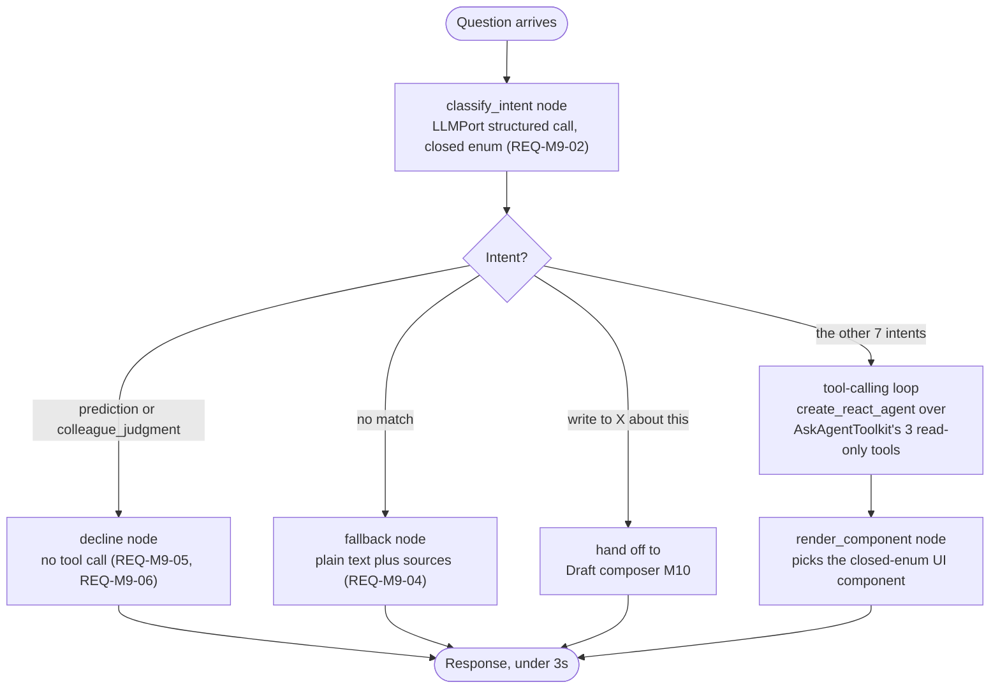

# 03 · LangGraph for the Ask agent — and nowhere else

| | |
|---|---|
| **Document** | Decision record — technology choice for orchestrating the one genuinely agentic module |
| **Status** | Approved |
| **Date** | 2026-08-14 |
| **Depends on** | `architecture/08-class-diagrams.md`, `architecture/09-clean-architecture-and-patterns.md`, `architecture/05-agent-catalog.md` |
| **Amends** | `.specify/memory/constitution.md` (v1.1.0 → v1.2.0, Technology and Data Standards) |
| **Informs** | `specs/ROADMAP.md` feature 008 (`narrator-and-ask-agent`) — not yet specified; this decision is in place before that feature's `/speckit-plan` needs to cite it |

## The question

LangGraph was proposed for "solutions related to AI or LLM" generally. The system has **six** LLM touchpoints (`architecture/05-agent-catalog.md`): Tone, Intent, Meeting readers; Narrator; Ask agent; Draft composer. The question isn't "LangGraph, yes or no" — it's which of those six actually need what LangGraph provides.

## The answer: one of six — the Ask agent (M9)

| Component | LangGraph? | Why |
|---|---|---|
| Tone reader | **No** | Single structured-output call, zero tools, zero branching (`LLMPort.generate_structured`) |
| Intent reader | **No** | Same shape |
| Meeting reader | **No** | Same shape |
| Narrator | **No** | Single generation call over pre-ranked input, no tools, no loop (REQ-M7-01) |
| **Ask agent** | **Yes** | Multi-step: classify → call a read-only tool → read the result → pick a UI component. Real branching, real tool use |
| Draft composer | **No** | Single generation call, no tools, and must never gain one (`REQ-M10-P1`) |

Five of six components are exactly what `LLMPort` (`architecture/08-class-diagrams.md`) already models: one call in, one schema-shaped object out, no tools attachable because the interface has no parameter for one. LangGraph's entire value proposition — stateful graphs, cycles, tool-calling loops, checkpointed memory — has nothing to attach to on five of these six. Giving any of them a graph-capable runtime wouldn't add a capability the product needs; it would blur the "zero tools, zero side effects" guarantee that's currently structural, not conventional (`architecture/04-ai-safety-and-model-usage.md` Rule 2). **They keep `LLMPort`, unchanged, exactly as documented.**

## Why the Ask agent is different in kind, not just in size

`architecture/09-clean-architecture-and-patterns.md` §YAGNI already rejected several tempting patterns for this codebase: a plugin system for the 8 fixed readers, a generic event bus, a `Specification`-object framework for the validation gate's 4 fixed checks. Each of those was rejected because the thing being abstracted is small, fixed, and not genuinely extensible. The Ask agent doesn't fit that shape:

- **8 distinct intents** (`requirements/09-ask-agent.md` REQ-M9-02), each mapping to a different lookup and a different rendered component — real branching, not a single call with a schema.
- **An explicit decline path** (predictions, colleague judgments) and an **explicit fallback path** (no intent matched) — three qualitatively different outcomes from one entry point.
- **A named "Ask thread" screen** (spec §11.2) — the product's own vocabulary already implies conversational continuity is a plausible near-term expectation, not a speculative one invented for this document.
- Using LangGraph's prebuilt `create_react_agent` here is **not more code** than hand-rolling the equivalent tool-use loop over the Anthropic SDK directly — so adopting it isn't paying complexity for nothing. It's swapping hand-rolled control flow for library-provided control flow of comparable size, while banking two things for free: **streaming** (maps directly onto the dashboard's Ask bar `Idle / Thinking / Answered` states, `requirements/08-health-dashboard.md` REQ-M8-02) and **checkpointing** (positions the Ask thread for multi-turn memory without a later rewrite, turned on only when that need actually materializes).

This is the same reasoning P10 (YAGNI) already uses elsewhere, applied honestly in the direction that supports adopting a tool here rather than only ever supporting rejecting one.

## The design

| Piece | What it is |
|---|---|
| `AskAgentState` | The graph's state schema: `question`, `intent`, `tool_calls`, `tool_results`, `component`, `component_props`, `fallback_text`, `declined_reason` |
| `classify_intent` | An `LLMPort.generate_structured` call — same port, same zero-tool discipline as the readers — against the closed enum from REQ-M9-02 |
| The tool-calling loop | LangGraph's `create_react_agent` (or an equivalent `StateGraph` with a `ToolNode`) bounded to a **fixed set of 3 tools** |
| `AskAgentToolkit` | The tool registry — thin wrappers around `EventRepositoryPort.query(...)`, `FindingRepositoryPort.get_validated_since(...)`, `ScoreRunRepositoryPort.get_latest(...)` — the **same repository ports** already defined for M1–M6 (`architecture/08-class-diagrams.md`). No new data-access code exists for M9; it reuses what M1–M6 already built |
| `render_component` | Maps the tool result(s) onto one of the closed set of UI components from REQ-M9-02 — never free-form generation |
| `decline` / `fallback` | Terminal nodes that never call a tool — the fastest paths through the graph, matching `architecture/06-error-handling.md`'s 2.5s/no-retry budget for the Ask agent |

## Where this lives in the layering (unchanged rule, new instance)

Per `architecture/09-clean-architecture-and-patterns.md` (constitution P8), the compiled graph is **Adapters ring** code — it's framework machinery (`StateGraph`, `create_react_agent`, `.compile()`), no different in kind from `SqlAlchemyFindingRepository` being an adapter. It implements an `AskAgentPort` the Application layer depends on:

- `AskAgentPort` (port, `experience/application/`) — `answer(question: str, user: User, session_id: Optional[UUID]) -> AskAgentResult`
- `LangGraphAskAgent` (adapter, `experience/adapters/ask_agent_graph.py`) — implements `AskAgentPort`, holds the compiled graph and (optionally) a checkpointer
- `AskAgentToolkit` (adapter, same file or a sibling) — builds the 3-tool registry from the injected repository ports

Nothing about the Dependency Rule changes. This is the rule's next instance, not an exception to it — see the updated class diagram in `architecture/08-class-diagrams.md`.

## The structural guarantee this preserves, not loosens

`.specify/memory/constitution.md`'s AI-safety rules already state, verbatim: *"the Ask agent's tools are read-only lookups only."* `AskAgentToolkit` is the enforcement mechanism — it only ever wraps `get_*`/`query_*` methods on repository ports that themselves have no write methods reachable from this context (`FindingRepositoryPort`'s `save`/`quarantine` methods are simply never registered as tools). A future engineer adding a 4th tool to the toolkit can only add another read; there is no code path in `experience/adapters/` that could register a write, a send, or a call to `DraftMessage`'s creation path as a tool — that would require importing a port this module was never given.

## Checkpointing — Post-MVP, not day one

The graph is built to support a Postgres-backed checkpointer (`langgraph-checkpoint-postgres` — no new infrastructure, uses the same Postgres already running, consistent with `architecture/03-technology-stack.md`'s "no message broker" stance) from the start, but **it stays off in the MVP**: each question is answered statelessly, exactly matching current `requirements/09-ask-agent.md` (no REQ-M9 requirement describes cross-question memory today). Turning checkpointing on later — for genuine multi-turn "Ask thread" continuity, if and when that's actually requested — is a configuration change to `LangGraphAskAgent`, not a rewrite of the graph's structure. This is the concrete form of the option-value argument made above: the cost of being ready is paid once, now, cheaply; the cost of not being ready would be a rewrite, later, under a real feature deadline.

## What this is not

- Not a message broker, not a new deployment topology, not a departure from "one Postgres, no broker" (`architecture/03-technology-stack.md`).
- Not a change to model ID pinning (`decisions/02-repo-and-tooling.md`) — the graph's nodes still call the pinned Sonnet-class model through the same discipline as every other generation call.
- Not a new REQ-ID. LangGraph fulfills `REQ-M9-01`…`REQ-M9-08` faithfully; it is an implementation choice, not a new behavior — `requirements/09-ask-agent.md`'s Traceability section is updated to point here, its requirements are not renumbered.

## Traceability

`architecture/03-technology-stack.md`, `architecture/05-agent-catalog.md`, `architecture/08-class-diagrams.md`, `architecture/09-clean-architecture-and-patterns.md`, `requirements/09-ask-agent.md`, `architecture/06-error-handling.md` (Ask agent's 2.5s/no-retry budget, unchanged), `.specify/memory/constitution.md` (P2, P3, P8, P10, AI-safety rules), `specs/ROADMAP.md` feature 008.
