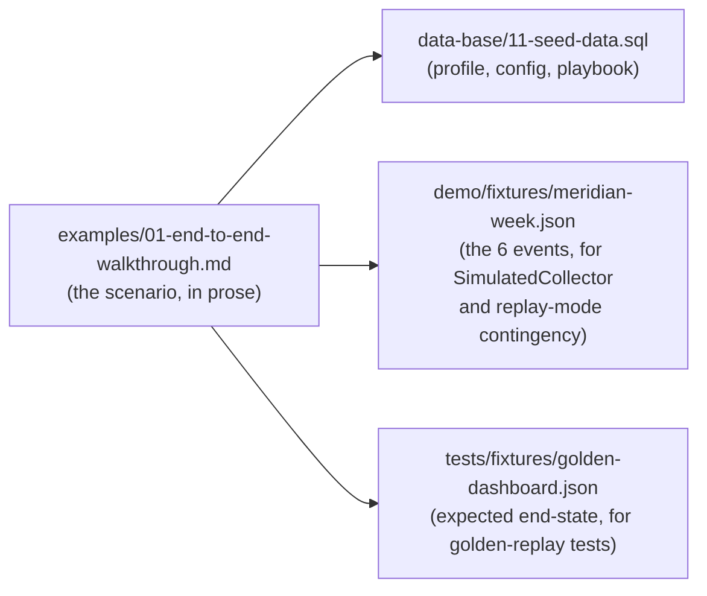

# 03 · Demo environment and fixtures checklist

Everything the live demo (`demo/01-live-demo-runbook.md`) needs that **isn't a document** — accounts, credentials, seeded history, and a backup environment. None of this can be prepared by writing more markdown; it's the physical/account-setup work that has to happen before the runbook is rehearsable. Owner and status columns are here so this checklist functions as the actual pre-demo punch list, not just a description of what's needed.

## Why the Gmail account needs weeks of history *before* demo day

The Tone reader is baseline-relative by design (spec P7, REQ-M5-06) and abstains below 5 historical samples (`requirements/13-scoring-calibration-appendix.md` REQ-M6-CAL-04). If the demo Gmail account is created the morning of the demo, the Tone reader has nothing to compare against — it will correctly, honestly abstain, and the single most compelling part of the demo (the score moving on live evidence) won't fire. **This has to be seeded from day one of demo prep, not day-of.** Budget 4–6 weeks of realistic back-and-forth email history between "Ana" and the vendor side before it's usable as a baseline.

## Checklist

| # | Item | Detail | Owner | Status |
|---|---|---|---|---|
| 1 | Demo Gmail account created | A real Gmail address acting as `ana.reyes@meridian.com` for the demo | — | ☐ |
| 2 | 4–6 weeks of "healthy" email history seeded | Realistic message rhythm, greeting rate, average length — this *is* the Tone reader's baseline window (`data-base/03-schema-ledger.md` `baseline_confirmations`) | — | ☐ |
| 3 | Baseline windows confirmed | A human (`REQ-M6-CAL-04`) confirms the healthy window via `baseline_confirmations` before demo day — an unconfirmed baseline means `rollups.is_baseline` stays false and the Tone reader has nothing to compare against even with enough raw history | — | ☐ |
| 4 | Google Cloud OAuth app registered | Gmail API, read-only scope (`requirements/01-signal-collectors.md` REQ-M1-P4) | — | ☐ |
| 5 | Zendesk trial/sandbox account | Seeded with ticket #456 (reopened, breach) and #398 (resolved fast) matching `examples/01-end-to-end-walkthrough.md` §4 | — | ☐ |
| 6 | Anthropic API key | Pinned to the model IDs in `decisions/02-repo-and-tooling.md` (`claude-haiku-4-5-20251001`, `claude-sonnet-5`) | — | ☐ |
| 7 | OpenAI API key | Embeddings only (`text-embedding-3-small`), per `architecture/03-technology-stack.md` | — | ☐ |
| 8 | Domain + hosting for a stable demo URL | Not `localhost` — a real, reachable URL survives a laptop restart or a projector-handoff mid-demo | — | ☐ |
| 9 | Warehouse fixture data | Synthetic `tracking_api` usage series, 8-week trailing baseline plus the 3-week, 22% drop (`requirements/13-scoring-calibration-appendix.md` REQ-M6-CAL-06) | — | ☐ |
| 10 | CSAT fixture data | Ana's prior response (score 9) and the current one (score 6, with the comment) | — | ☐ |
| 11 | Slack Connect sandbox | Diego's 12-day silence and two missed syncs, seeded relative to demo day (not a fixed past date that ages out) | — | ☐ |

## The Meridian dataset as versioned fixtures

`examples/01-end-to-end-walkthrough.md` already contains the full scripted scenario — 6 events, 9 findings, worked arithmetic, all consistent with `data-base/11-seed-data.sql`. That scenario is the **single source of truth** for three different consumers, and all three must be regenerated together whenever the scenario changes, never edited independently:

A `SimulatedCollector` (implementing the same `Collector` interface as the real Gmail/Zendesk adapters, `architecture/02-component-catalog.md`) reads `demo/fixtures/meridian-week.json` and emits envelopes exactly as a real collector would — this is what powers both the golden-replay test suite (`tests/strategy.md`) and the demo's contingency path (`demo/01-live-demo-runbook.md` §Contingency), from the same fixture file. Keeping the scenario, the seed data, and the fixture in sync is a single regeneration script, not three manual edits.

## Redundant demo environment

The live demo depends on network connectivity for the live-API portions (`demo/01-live-demo-runbook.md` steps involving the real Gmail send). Two independent failure points need a plan each:

| Risk | Mitigation |
|---|---|
| Venue wifi is unreliable or blocked | A **local** deployment (the same Docker Compose stack, run on the presenter's laptop, `architecture/03-technology-stack.md`) as a hot spare — replay mode works fully offline since it never calls a live source API, only the LLM providers, which need internet regardless |
| The hosted demo URL goes down (host issue, not network) | A second, independently-deployed Compose stack (different host/region) with the same seed data, switchable via a pre-tested bookmark, not a live redeploy |
| Both LLM providers are unreachable | No good live fallback exists for this one — the readers and narrator genuinely need Claude, and Recurrence needs OpenAI embeddings. Mitigation is entirely preventive: verify both providers' status pages the morning of the demo, and have `demo/01-live-demo-runbook.md`'s error-handling behavior (`architecture/06-error-handling.md` — readers abstain, narrator falls back to deterministic template) ready to narrate honestly as a feature, not hidden as a failure |

## Traceability

`demo/01-live-demo-runbook.md`, `demo/02-impact-story.md`, `examples/01-end-to-end-walkthrough.md`, `data-base/11-seed-data.sql`, `requirements/13-scoring-calibration-appendix.md`, `architecture/06-error-handling.md`.
