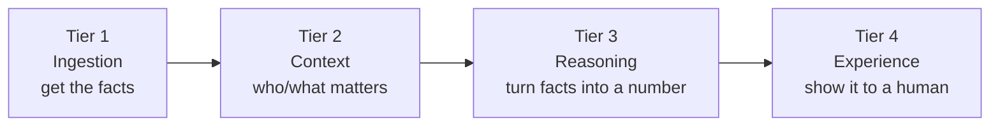
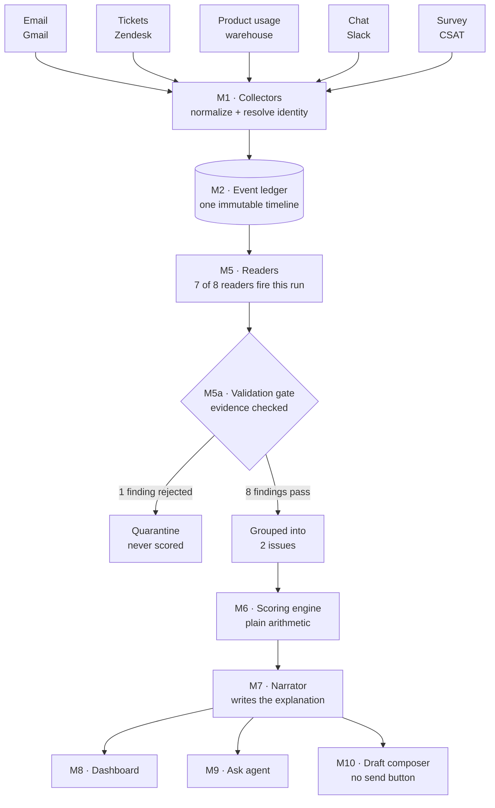
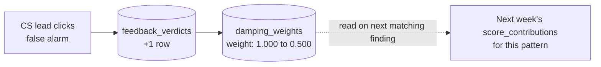

# End-to-end worked example — five signals, one score

| | |
|---|---|
| **Purpose** | Show the *entire* system running once, from raw signals arriving to the number on screen, using real (invented but realistic) data — table by table, process by process. |
| **Audience** | Anyone who wants to understand the system without already knowing it — no prior familiarity with the spec, the modules, or the database is assumed. |
| **How to read it** | Top to bottom, in order. Each step says: *what happens*, *which table(s) it writes to*, *what process/component does the writing*, and *why*. Every table name is a link back to its full definition in `data-base/`. |

If you only read one document to understand how this product works end to end, read this one.

---

## 0. Five words you need before we start

The system's own vocabulary, defined in plain terms (full glossary: `requirements/00-overview-and-glossary.md`):

| Word | Plain meaning |
|---|---|
| **Event** | One fact that happened, stored forever, never edited — "Ana sent this email at 09:14." |
| **Finding** | One structured *observation* built from one or more events — "Ana's tone has gotten worse." A finding is an opinion; an event is a fact. |
| **Issue** | A bundle of findings that all point at the same underlying problem, so we don't count one broken feature five times. |
| **Score** | The single 0–100 number, recomputed from zero every time, that summarizes how the relationship is doing. |
| **Evidence / trace** | The clickable path from the score, back through the finding, back to the original message — nothing is ever asserted without a receipt. |

The system is built in four layers ("tiers"), and information only ever flows forward through them:



This document walks one real pass through all four tiers.

> **Which phase is this?** This walkthrough deliberately shows the system at **full strength** — all five source types connected — so every reader and every table in this database gets exercised at least once. Per `decisions/01-mvp-scope-and-phasing.md`, the actual **Phase 1** ("first solution") build ships with only 3 of these 5 sources (Email, Tickets, Product usage); Chat and Survey are **Phase 2** additions. The source table in §1 below tags each row with its phase. If you want to see what a *Phase 1* run looks like, mentally remove sources 4 and 5 — Issue B would then rest on Ana's tone, intent, and CSAT-free evidence alone, and Diego's absence/relationship findings wouldn't exist yet (no chat to observe them in).

---

## 1. The scenario

**Client:** Meridian Logistics (the same example client used throughout `base/Churn-Sentiment-Agent-Product-Specification.md` and this repo's other documents).

**People who matter, as defined in the client profile** (see `data-base/04-schema-context.md`):

| Stakeholder | Role | Influence | Why it matters |
|---|---|---|---|
| Ana Reyes | CTO | `sponsor` (multiplier **1.6**) | She signs the renewal. Anything she says or does is weighted heaviest. |
| Diego Marín | Dev lead | `daily_user` (multiplier **1.2**) | Uses the product daily; his engagement is a strong health signal. |

**Product areas:**

| Area | Criticality | Why it matters |
|---|---|---|
| `tracking_api` | `critical` (multiplier **1.5**) | The client's core workflow depends on it. |
| `reporting` | `standard` (multiplier **1.0**) | Useful, not load-bearing. |

**The week we're examining:** five different systems each report something, on their own schedule, with no coordination between them — exactly as it would happen in real life. This is the whole point of the product: nobody at Meridian or at the vendor sees all five things at once. The system does.

| # | Source | Phase | What happened | Who/what it's about |
|---|---|---|---|---|
| 1 | **Email** (Gmail) | **1** | Ana writes: *"Please advise on the timeline. I need to brief the board on Thursday."* — short, no greeting, mentions the board. | Ana · relationship tone |
| 2 | **Tickets** (Zendesk) | **1** | Ticket #456 "Slow API response" is reopened for the **second time**; first response took **19 business hours** against a **4-hour** promise. Separately, ticket #398 (a minor CSV-export request) is resolved in 2 hours — well inside SLA. | `tracking_api` · a broken promise, and a kept one |
| 3 | **Product usage** (warehouse telemetry) | **1** | Daily active usage of `tracking_api` is down **22%** over the last 3 weeks compared to the prior 8-week average. | `tracking_api` · behavior, not words |
| 4 | **Chat** (Slack Connect) | **2** | Diego, who normally posts ~5×/week in the shared channel, has posted **zero** times in 12 days, and skipped the weekly sync twice. | Diego · going quiet |
| 5 | **Survey** (CSAT) | **2** | Ana's CSAT response drops from **9** (three months ago) to **6** (this week), with the comment *"Support has been slower than we'd like lately."* | Ana · a number this time, not just words |

Sources 1–3 are what a real Phase 1 deployment sees today. Sources 4–5 (and the fuller-strength Absence/Relationship readings they enable) are Phase 2 — included here so this document can double as the complete architectural reference, not just the Phase 1 demo script.

None of these five facts, alone, would trigger an escalation. Together, they will.

---

## 2. The big picture



We now walk through every box, left to right, and open up the database tables behind each one.

---

## 3. Step 1 — Five raw signals arrive

Nothing is stored yet. Five independent systems each have new data sitting in their own APIs, waiting to be fetched. There is no table for this step — it is simply "the world," outside the system's boundary.

---

## 4. Step 2 — Collectors turn raw signals into envelopes

**Who does this:** Module **M1 · Signal collectors** — one small adapter program per source. Each adapter's only job is: fetch, figure out who sent it, wrap it consistently, and hand it off. It is *not allowed* to decide whether something matters (see `requirements/01-signal-collectors.md`).

### 4.1 `sources` — one row already exists per connected system

This table was set up once, when Meridian was onboarded. We just read it here to know *where* to fetch from.

| id | source_type | display_name | status |
|---|---|---|---|
| src-email | `gmail` | Meridian — Email | connected |
| src-tickets | `zendesk` | Meridian — Support | connected |
| src-usage | `warehouse` | Meridian — Product usage | connected |
| src-chat | `slack` | Meridian — Slack Connect | connected |
| src-survey | `csat` | Meridian — CSAT | connected |

### 4.2 `collector_runs` — one row every time an adapter runs

Each source polls (or receives a webhook) independently. Five sources firing this week means five separate collector runs, at five different times:

| id | source_id | trigger | envelopes_emitted | duplicates_skipped |
|---|---|---|---|---|
| run-1 | src-email | webhook | 1 | 0 |
| run-2 | src-tickets | poll | 2 | 0 |
| run-3 | src-usage | poll | 1 | 0 |
| run-4 | src-chat | poll | 1 | 0 |
| run-5 | src-survey | webhook | 1 | 0 |

`duplicates_skipped` stays at 0 here, but this is the column that proves the "running a collector twice never creates duplicates" guarantee (`requirements/01-signal-collectors.md` REQ-M1-03) — if this poll re-fetched something it already saw, it would be counted and thrown away here, not appended twice to the ledger.

### 4.3 `identity_map` — who is this, really?

Before anything can be scored with the right weight, the system has to know *who* sent it. This table is the phone book.

| source_identifier | source_type | stakeholder_id | resolved_by |
|---|---|---|---|
| ana.reyes@meridian.com | gmail | stk-ana | exact_match |
| (Zendesk reporter contact) | zendesk | *(unresolved — generic support contact, not a named stakeholder)* | unresolved |
| diego@meridian.com | slack | stk-diego | exact_match |
| ana.reyes@meridian.com | csat | stk-ana | exact_match |

Notice the ticket reporter resolves to **nobody in particular** — that's fine and expected (REQ-M1-05): the system never guesses an identity match just to fill a field. The ticket will still be scored, just without a stakeholder-influence multiplier attached (we'll see this matter in Step 7).

### 4.4 `raw_envelopes` — the standard wrapper, one row per fetched item

Every source's output gets forced into the same shape here, before it's allowed anywhere near the ledger. This is also where message bodies are **encrypted** (`payload_encrypted` + `data_key_ref`) and where any excluded content would be stripped (`redacted_fields`) — neither applies to this batch.

| id | collector_run_id | source_native_id | idempotency_key | occurred_at | identity_status |
|---|---|---|---|---|---|
| env-1 | run-1 | gmail-msg-8831 | hash(gmail, 8831) | Mon 09:14 | resolved |
| env-2 | run-2 | zendesk-456 | hash(zendesk, 456) | Mon 07:40 | unresolved |
| env-3 | run-2 | zendesk-398 | hash(zendesk, 398) | Tue 11:02 | unresolved |
| env-4 | run-3 | usage-tracking_api-w34 | hash(warehouse, w34) | Wed 00:00 | resolved *(product-level, not personal)* |
| env-5 | run-4 | slack-absence-diego-12d | hash(slack, absence-diego) | Thu 08:00 | resolved |
| env-6 | run-5 | csat-resp-5521 | hash(csat, 5521) | Fri 10:15 | resolved |

`idempotency_key` is what makes REQ-M1-03 real: it carries a database `UNIQUE` constraint, so even a bug that re-fetches `zendesk-456` tomorrow cannot insert a second row here.

**What happens next:** each envelope is handed, one at a time, to the event ledger. This is the moment raw material crosses from "temporary staging" into "permanent record."

---

## 5. Step 3 — The ledger appends immutable events

**Who does this:** Module **M2 · Event ledger** (`requirements/02-event-ledger.md`). This is the single most important table in the whole system: **`events`**. Nothing is ever updated or deleted here — only appended. If a correction is needed later, a *new* row is added that references the old one; the old one stays exactly as it was written.

### 5.1 `events` — six new rows, one per envelope

| id | envelope_id | event_type | occurred_at | recorded_at | stakeholder_id | product_area_id | structured_payload (summary) |
|---|---|---|---|---|---|---|---|
| evt-1 | env-1 | message | Mon 09:14 | Mon 09:14:03 | stk-ana | — | "Please advise on the timeline. I need to brief the board on Thursday." |
| evt-2 | env-2 | ticket_state_change | Mon 07:40 | Mon 07:41 | *(null)* | tracking_api | {ticket: 456, title: "Slow API response", reopen_count: 2} |
| evt-3 | env-3 | ticket_state_change | Tue 11:02 | Tue 11:03 | *(null)* | reporting | {ticket: 398, title: "Add CSV export", resolved_in_hours: 2} |
| evt-4 | env-4 | usage_measurement | Wed 00:00 | Wed 00:05 | — | tracking_api | {metric: weekly_active_usage, value: -22%} |
| evt-5 | env-5 | absence | Thu 08:00 | Thu 08:00 | stk-diego | — | {expected: weekly_sync, missed_count: 2, silent_days: 12} |
| evt-6 | env-6 | survey_response | Fri 10:15 | Fri 10:16 | stk-ana | — | {score: 6, previous_score: 9, comment: "Support has been slower than we'd like lately."} |

Two things worth pausing on, because they're easy to miss and they matter a lot:

- **Two different timestamps.** `occurred_at` is *when the thing really happened* (e.g. the email was sent Monday at 09:14). `recorded_at` is *when our system found out about it* (a few seconds later, once the collector ran). Normally these are seconds apart, like above — but if a source was down for two days and we only found out about a Monday email on Wednesday, `occurred_at` would still say Monday while `recorded_at` says Wednesday. This is what lets the system honestly answer "what did we know as of last Tuesday?" (`data-base/03-schema-ledger.md`).
- **Nothing here says anything is wrong.** `evt-2` records "19 hours elapsed, second reopen" as a plain fact. It does **not** say "this is bad." That judgment doesn't exist yet — it gets made in Step 4, by a completely different, more accountable part of the system. This separation (facts here, opinions later) is deliberate and is one of the product's core rules (`requirements/02-event-ledger.md` REQ-M2-P1).

### 5.2 `response_pairs` — turning ticket #456 into a measurable promise

A **projection** (a derived table, rebuildable at any time from `events` alone — see `data-base/01-database-overview.md`). It pairs a client message with its reply and measures the gap in *business hours*, using Meridian's own working calendar (08:00–18:00, America/Bogota, per the client profile).

| id | client_event_id | commitment_id | business_hours_elapsed | state |
|---|---|---|---|---|
| rp-1 | evt-2 (ticket #456) | commitment (first_response, P1, 4h) | 19.0 | `open_overdue` |
| rp-2 | evt-3 (ticket #398) | commitment (first_response, P1, 4h) | 2.0 | `resolved` |

This is pure arithmetic — no judgment yet, just "19 hours against a 4-hour promise" and "2 hours against the same promise." Whether 19 hours is *bad* is decided next.

### 5.3 `rollups` — updating what "normal" looks like

| subject_type | subject_id | metric | value | is_baseline |
|---|---|---|---|---|
| stakeholder | stk-ana | avg_words_per_message | 14 (this message) vs. 47 (baseline) | false |
| stakeholder | stk-ana | greeting_rate | 0 of last 3 messages had a greeting, vs. 11 of 12 historically | false |
| product_area | tracking_api | weekly_active_usage | −22% vs. 8-week average | false |
| account | — | csat_score | 6, previous 9 | false |

These rollups exist so that readers (next step) never have to scan the whole history every time — they just compare "now" against a pre-computed "normal."

### 5.4 `coverage_reports` — proving nothing was missed

| collector_run_id | sources_expected | sources_read | complete_to |
|---|---|---|---|
| run-1..5 | 5 | 5 | Fri 10:16 |

All five sources reported in. If one had failed (say, Slack), this table would show `sources_read: 4` and the dashboard's coverage line would say so honestly — the score would freeze rather than pretend it saw everything (`requirements/11-non-functional-requirements.md` REQ-NFR-07).

**What happens next:** the ledger tells the readers "these six new events, and the rollup windows they touched, need a fresh look."

---

## 6. Step 4 — Readers turn events into findings

**Who does this:** Module **M5 · Interpreters**, a set of eight independent specialists (`requirements/05-interpreters-readers.md`). Each one answers exactly *one* question, using only the events relevant to that question. Three of them use a language model (Tone, Intent, Meeting); the rest are ordinary code or statistics. None of them can see or influence each other.

Here is what fires this week:

| Reader | Type | Question it asks | Fires this week? | Needs a Phase 2 source? |
|---|---|---|---|---|
| **Commitment** | code | Did a reply exceed the promised response time? | ✅ ticket #456 | No — Phase 1 |
| **Recurrence** | embeddings + clustering | Is this the same problem coming back? | ✅ ticket #456 (2nd reopen) | No — Phase 1 |
| **Usage** | statistics | Has activity deviated from normal? | ✅ `tracking_api` usage, ✅ CSAT score | Usage-on-warehouse: no. Usage-on-CSAT: **yes, Phase 2** |
| **Absence** | statistics | Is expected contact missing? | ✅ Diego | **Yes, Phase 2** (chat-based silence — Phase 1's version only sees missed email/ticket replies) |
| **Relationship** | graph diff | Has the cast of people changed? | ✅ Diego stepping back | **Yes, Phase 2** (needs the Slack participant graph) |
| **Tone** | LLM | Is this person writing differently than *they* normally do? | ✅ Ana's email | No — Phase 1 (email) |
| **Intent** | LLM | Escalation / competitive / contractual language? | ✅ Ana's "board" mention | No — Phase 1 (email) |
| **Meeting** | LLM | What was verbally promised, by when? | ⚪ *abstains — no transcript this week* | N/A — idle until Phase 2 connects a transcript source |

The Meeting reader producing **nothing** is not a bug — it is the correct behavior when there's no material to work from (REQ-M5-04). A system that invents a finding just to have something to say would be actively dangerous here; "no history, no opinion" is a design principle, not a gap.

### `findings` — one row per observation, each with a receipt

Every single row below carries `cited_event_ids` pointing back to Step 3's `events` table — a finding that cannot point to a real event is not just discouraged, it is **impossible to insert** (the database rejects an empty citation list, `data-base/05-schema-reasoning.md`).

| id | reader_type | finding_type | magnitude | confidence | cited_event_ids | about |
|---|---|---|---|---|---|---|
| fnd-1 | commitment | `broken_response_promise` | 1.00 | 1.00 | [evt-2] | ticket #456, 19h vs 4h |
| fnd-2 | recurrence | `recurring_issue` | 0.60 | 0.75 | [evt-2] | this is the 2nd reopen of the same root cause |
| fnd-3 | usage | `usage_deviation` | 0.55 | 0.90 | [evt-4] | tracking_api usage down 22% |
| fnd-4 | absence | `contact_absence` | 0.70 | 0.85 | [evt-5] | Diego silent 12 days, missed sync ×2 |
| fnd-5 | relationship | `relationship_change` | 0.40 | 0.70 | [evt-5] | Diego effectively inactive in the channel |
| fnd-6 | tone | `tone_deterioration` | 0.60 | 0.80 | [evt-1] | Ana: shorter, no greeting, vs. her own baseline |
| fnd-7 | intent | `escalation_language` | 0.50 | 0.85 | [evt-1] | "brief the board" — an escalation phrase |
| fnd-8 | usage | `csat_deviation` | 0.50 | 0.95 | [evt-6] | Ana's CSAT: 9 → 6 |
| fnd-9 | commitment | `commitment_met` *(positive)* | 0.40 | 1.00 | [evt-3] | ticket #398 resolved in 2h, well inside SLA |
| fnd-10 | tone | `tone_deterioration` | 0.55 | **0.55** | [evt-5] | *attempted:* Diego's tone in Slack — but only 1 historical sample exists |

`fnd-1` through `fnd-9` are solid. `fnd-10` was attempted — the Tone reader tried to say something about *how* Diego wrote in Slack, not just *that* he went quiet — but it only had one prior message to compare against, so its own confidence came out low (0.55). That finding is about to be caught by the next step, on purpose.

Notice also what did **not** happen: no reader tried to guess *why* Ana's CSAT score dropped, or build any narrative about Diego's personal situation. Readers report *what changed*, never *why* — causal storytelling is explicitly out of scope (`requirements/05-interpreters-readers.md` REQ-M5-P3, spec §13.2).

**What happens next:** all ten attempted findings go to the validation gate before any of them are allowed anywhere near a score.

---

## 7. Step 5 — The validation gate checks the receipts

**Who does this:** Module **M5a · Validation gate** (`requirements/05-interpreters-readers.md`). Four checks, no exceptions, no repairs: (1) is it shaped correctly, (2) do the cited events actually exist, (3) is there enough evidence for this type of finding, (4) does its confidence clear that finding type's minimum bar. This bar is set per finding type in `finding_type_config`:

| finding_type | confidence_floor | min_evidence_count |
|---|---|---|
| `tone_deterioration` | 0.65 | 3 |
| `broken_response_promise` | 0.50 | 1 |
| *(others similar — omitted for brevity)* | | |

Running `fnd-10` (Diego's Slack tone, confidence 0.55) against `tone_deterioration`'s floor of 0.65: **it fails.**

### `quarantine` — where failed findings go to be remembered, not fixed

| id | finding_id | failed_check | detail |
|---|---|---|---|
| q-1 | fnd-10 | `confidence_below_floor` | confidence 0.55 < required 0.65 for `tone_deterioration` |

### `validation_failures` — the specific reason, logged

| quarantine_id | check_name | expected | actual |
|---|---|---|---|
| q-1 | confidence_floor | ≥ 0.65 | 0.55 |

Nobody edits `fnd-10` to "fix" it and try again — that is explicitly forbidden (REQ-M5A-03). It sits in quarantine permanently, visible on the internal "System health" screen, as part of an honest record of what the readers get wrong — which is exactly the dataset a team would use later to decide whether the Tone reader needs a higher evidence bar in general.

**Findings that pass and move forward:** fnd-1 through fnd-9 — **nine** findings, all validated.

**What happens next:** validated findings get grouped before scoring, so one broken feature can't be counted five separate times.

---

## 8. Step 6 — Grouping findings into issues

**Who does this:** still Module **M5/M6** boundary — clustering is a scoring-adjacent step (`requirements/06-scoring-engine.md` REQ-M6-06). The question being asked here is simple: *do several of these findings actually describe the same underlying problem?* If yes, only the loudest one counts at full strength; the rest count for progressively less. This is what stops "the tracking API is broken" from being counted once for the ticket, once again for the reopen, and a third time for the usage drop.

Looking at our nine findings, two natural clusters emerge:

- **Issue A — "tracking_api is broken":** the ticket breach, the recurrence, and the usage drop are all downstream of one real problem.
- **Issue B — "the relationship with Meridian's decision-makers is cooling":** Ana's tone, Ana's escalation language, Ana's CSAT drop, and Diego pulling back are all downstream of one real pattern — even though they involve two different people and three different sources.

`fnd-9` (the positive: ticket #398 resolved fast) doesn't belong to either negative story — it stands alone, which is fine; not every finding needs a cluster.

### `issues`

| id | label | cluster_method |
|---|---|---|
| iss-A | Issue A — tracking_api reliability | shared_entity *(same ticket / same product area)* |
| iss-B | Issue B — Ana & Diego disengaging | embedding_similarity *(different words, same underlying story)* |

### `finding_issue_map`

| finding_id | issue_id | rank_within_issue |
|---|---|---|
| fnd-1 (broken promise) | iss-A | 1 |
| fnd-2 (recurrence) | iss-A | 2 |
| fnd-3 (usage down) | iss-A | 3 |
| fnd-7 (Ana escalation) | iss-B | 1 |
| fnd-4 (Diego absence) | iss-B | 2 |
| fnd-6 (Ana tone) | iss-B | 3 |
| fnd-8 (Ana CSAT) | iss-B | 4 |
| fnd-5 (Diego relationship) | iss-B | 5 |

`rank_within_issue` is what makes the "diminishing returns" rule from the next step possible — the biggest contributor in an issue counts fully, the next one counts for 60% of its own value, then 36%, then 22%, and so on. We'll see exactly how in a moment.

**What happens next:** these ranked, grouped findings — plus `fnd-9`, standing alone — are handed to the one component in the entire system that is deliberately, strictly *not* smart.

---

## 9. Step 7 — The scoring engine computes the number

**Who does this:** Module **M6 · Scoring engine** (`requirements/06-scoring-engine.md`). This is plain arithmetic — **no model call happens anywhere in this step.** Every number below can be checked on a calculator. The formula, from `requirements/06-scoring-engine.md` REQ-M6-01:

```
points = base × influence × criticality × confidence × magnitude × recency × damping
```

Then, within each issue, the ranked findings are multiplied again by a diminishing factor (1st = 100%, 2nd = 60%, 3rd = 36%, 4th = 22%, 5th ≈ 13% — each step is ×0.6 of the last, REQ-M6-07).

### 9.1 Where each multiplier comes from

- **base** — a fixed point value per finding type, from `finding_type_config` (e.g. a broken response promise is worth more than a relationship blip).
- **influence** — 1.6 for Ana (sponsor), 1.2 for Diego (daily user), **1.0** for anything not tied to a specific stakeholder (like the ticket, whose reporter never resolved to a named person back in Step 2 — a good example of why identity resolution mattered).
- **criticality** — 1.5 for `tracking_api` (critical), 1.0 for anything not tied to a product area (people-related findings).
- **confidence** and **magnitude** — copied straight from the finding (Step 4) — how sure the reader was, and how big the change was.
- **recency** — 1.0 normally; **1.3** for ticket #456 specifically, because it's not just open, it's *overdue* (`open_overdue` from Step 5.2) — the clock ageing against us.
- **damping** — 1.0 for everything this week. Nobody has given feedback yet, so nothing is being discounted. (Step 12 shows this changing.)

### 9.2 Issue A — tracking_api reliability

| Finding | base | influence | criticality | confidence | magnitude | recency | rank factor | points |
|---|---|---|---|---|---|---|---|---|
| fnd-1 broken promise | 20 | 1.0 | 1.5 | 1.00 | 1.00 | 1.3 | 1.00 (1st) | **39.00** |
| fnd-2 recurrence | 12 | 1.0 | 1.5 | 0.75 | 0.60 | 1.0 | 0.60 (2nd) | **4.86** |
| fnd-3 usage down | 15 | 1.0 | 1.5 | 0.90 | 0.55 | 1.0 | 0.36 (3rd) | **4.01** |
| | | | | | | | **Issue A total** | **47.87** |

*(fnd-1's number — 39.00 — deliberately matches the worked example in the product spec itself, §10: the same finding type, computed the same way, always gives the same answer. That consistency is the point of Module M6 being "deliberately unintelligent.")*

### 9.3 Issue B — Ana & Diego disengaging

| Finding | base | influence | criticality | confidence | magnitude | recency | rank factor | points |
|---|---|---|---|---|---|---|---|---|
| fnd-7 Ana escalation | 14 | 1.6 | 1.0 | 0.85 | 0.50 | 1.0 | 1.00 (1st) | **9.52** |
| fnd-4 Diego absence | 12 | 1.2 | 1.0 | 0.85 | 0.70 | 1.0 | 0.60 (2nd) | **5.14** |
| fnd-6 Ana tone | 10 | 1.6 | 1.0 | 0.80 | 0.60 | 1.0 | 0.36 (3rd) | **2.76** |
| fnd-8 Ana CSAT | 10 | 1.6 | 1.0 | 0.95 | 0.50 | 1.0 | 0.22 (4th) | **1.67** |
| fnd-5 Diego relationship | 8 | 1.2 | 1.0 | 0.70 | 0.40 | 1.0 | 0.13 (5th) | **0.35** |
| | | | | | | | **Issue B total** | **19.44** |

Notice `fnd-4` (Diego's absence) actually has *more* raw weight than `fnd-6` (Ana's tone) before ranking — but because it landed in 2nd place in the issue, it's discounted to 60%, while a smaller-but-first-ranked finding would count fully. The ranking is decided by raw size, but paid out by position — this is exactly the mechanism that stops five symptoms of one problem from outscoring three separate real problems.

### 9.4 The positive finding

| Finding | base | influence | criticality | confidence | magnitude | recency | points |
|---|---|---|---|---|---|---|---|
| fnd-9 ticket #398 resolved fast | 10 | 1.0 | 1.0 | 1.00 | 0.40 | 1.0 | **4.00** |

Positive points are capped at 25% of the negative total, so goodwill can soften a score but never erase real damage (REQ-M6-14):

```
total_negative_points = 47.87 + 19.44 = 67.31
cap = 25% of 67.31 = 16.83
positive_points_applied = min(4.00, 16.83) = 4.00   ← under the cap, so it applies in full
```

### 9.5 From points to the number on screen

```
total_points = 67.31 − 4.00 = 63.31
score = 100 × (1 − e^(−63.31 / 33)) ≈ 85.3
```

### `score_runs` — one row for this entire computation

| id | trigger | total_negative_points | total_positive_points | positive_points_applied | total_points | score | raw_band | band |
|---|---|---|---|---|---|---|---|---|
| run-score-1 | `burst_batch` | 67.310 | 4.000 | 4.000 | 63.310 | **85.30** | at_risk | **at_risk** |

*(All five signals landed within the same 30-second batching window as far as the scoring engine is concerned, so this is one `burst_batch`-triggered run, not five separate recomputations — see `sequences/05-flow-recompute-triggers.md`.)*

### `score_contributions` — nine rows, reconciling to the decimal

Every single number from the two tables above is stored as its own row here — `base`, `influence`, `criticality`, `confidence`, `magnitude`, `recency`, `damping`, `rank_within_issue_factor`, and the final `points_contributed`. Summing the `points_contributed` column for all nine rows (39.00 + 4.86 + 4.01 + 9.52 + 5.14 + 2.76 + 1.67 + 0.35 + 4.00, with the positive row subtracted) reproduces `total_points` **exactly**, to the decimal — this reconciliation is a hard engineering requirement (`requirements/11-non-functional-requirements.md` REQ-NFR-30), not a nice-to-have. It's what lets a skeptical CS lead check the system's math on paper and be shown to be right to trust it.

### `band_history`

| score_run_id | band | consecutive_runs_in_band | notified |
|---|---|---|---|
| run-score-1 | at_risk | 2 *(this account was already at 70+ last week)* | true |

Because the account was already trending high, this is the **second** consecutive run above the 65 "enter" threshold — so the band confirms as **At risk** rather than waiting (the hysteresis rule, `sequences/06-state-band-hysteresis.md`). If this had been an isolated one-run spike from a healthy account, the displayed band would have stayed at `watch` for one more run before flipping.

**What happens next:** a number alone (85.30, At risk) isn't useful to a person. It needs words.

---

## 10. Step 8 — The narrator writes the explanation

**Who does this:** Module **M7 · Narrator** (`requirements/07-narrator.md`) — the first place a language model is allowed to touch the *presentation* of this run (readers used models too, back in Step 4, but only to produce structured data, never sentences). The narrator receives the ranked findings and their point values exactly as computed in Step 7 — it is not allowed to re-rank or re-weigh anything. Every name, number, and date it writes is mechanically checked against that input before anyone sees it; a sentence that invents a fact is silently dropped, never shown (REQ-M7-06/07).

### `narrator_outputs`

| score_run_id | headline | fact_check_passed |
|---|---|---|
| run-score-1 | "We took 19 hours to reply to a P1 ticket — we promised 4 — and Ana is pulling back at the same time." | true |

`reasons` (JSON, one entry per issue, each pointing at real evidence):

```json
[
  { "text": "We took 19 hours to reply. We promised 4. This is the second time this issue has come back.",
    "points": 47.87, "evidence_event_ids": ["evt-2"] },
  { "text": "Ana stopped greeting us and mentioned briefing the board — and she signs the renewal. Diego has gone quiet for 12 days.",
    "points": 19.44, "evidence_event_ids": ["evt-1", "evt-5", "evt-6"] }
]
```

`actions` (JSON — every action has an owner and a date, pulled from the human-written `playbook_actions` table, never invented):

```json
[
  { "text": "Escalate ticket #456 with engineering today", "owner": "Support lead", "due_date": "today", "playbook_id": "pb-escalate-p1" },
  { "text": "Call Ana before Thursday's board meeting — don't email", "owner": "CS lead", "due_date": "Wed", "playbook_id": "pb-call-sponsor" }
]
```

### `playbook_actions` (the two templates used above already existed, human-authored, before this run)

| id | template_text | applies_to_finding_type | default_owner_role |
|---|---|---|---|
| pb-escalate-p1 | "Escalate {ticket_ref} with engineering {when}" | `broken_response_promise` | Support lead |
| pb-call-sponsor | "Call {stakeholder_name} before {deadline} — don't email" | `escalation_language` | CS lead |

The narrator filled in the placeholders with real names and dates from this run's data; it did not write these action templates itself.

**What happens next:** everything computed so far — the score, the reasons, the actions — is now sitting in the database, ready to be *read*, not recalculated, by three different screens.

---

## 11. Step 9 — The dashboard shows it

**Who does this:** Module **M8 · Health dashboard** (`requirements/08-health-dashboard.md`). This step writes **no new table** — it is a pure read of everything produced above. That's the point: the dashboard loads in under a second because it never computes anything, it only displays `score_runs`, `narrator_outputs`, and `rollups` as they already sit in the database.

What the CS lead sees, matching `base/mockup-mainPage.jpg`'s layout:

- **Score block:** 85 · **At risk** · animates up from last week's number.
- **Contribution bars:** "Broken response promise +39", "Recurring issue +4.9", "Usage down +4.0", "Escalation language +9.5", "Diego's absence +5.1", "Ana's tone +2.8", "CSAT drop +1.7", "Diego stepping back +0.3", and in green, "Ticket #398 resolved fast −4.0."
- **Pulse timeline:** the six events from Step 3, each with its quoted text and a severity dot.
- **Stakeholder cards:** Ana (tone trajectory: deteriorating), Diego (status: quiet, last seen 12 days ago).
- **Coverage line:** "Reading 5 of 5 sources · complete to 10:16" — because `coverage_reports` (Step 5.4) says so.

Every number here is a clickable door back to Step 7's `score_contributions`, and from there to Step 3's `events` — the full evidence trace, in two clicks, exactly as required by `requirements/08-health-dashboard.md` REQ-M8-08.

---

## 12. Step 10 — Someone asks a question

**Who does this:** Module **M9 · Ask agent** (`requirements/09-ask-agent.md`). The CS lead types: *"Why did the score go up?"*

The agent does **not** recompute anything — it matches the question to one of a small, fixed set of known question types, then looks up already-stored data to answer it.

### `ask_queries`

| question_text | matched_intent | rendered_component | response_time_ms |
|---|---|---|---|
| "Why did the score go up?" | `score_delta` | Delta breakdown (per-cause points, from `score_contributions`) | 1,840 |

The answer shown is literally Step 9.5's arithmetic, re-rendered as a component — not a new calculation, and not a new model call.

---

## 13. Step 11 — Drafting a reply (and stopping there)

**Who does this:** Module **M10 · Draft composer** (`requirements/10-draft-composer.md`). The CS lead clicks "Write to Ana about this." The composer reads Issue A's evidence, Ana's communication style from the client profile (direct, brief), and writes:

### `draft_messages`

| id | issue_id | stakeholder_id | draft_text (excerpt) | tone_variant | checks_passed | logged_manually_at | copied_at |
|---|---|---|---|---|---|---|---|
| draft-1 | iss-A | stk-ana | *"Ana — we took 19 hours to respond to ticket #456; we promised 4. Engineering is on it today, and I'll call you before Thursday."* | direct | true | *(null)* | *(null)* |

The CS lead reads it, likes it, and clicks **"Copy draft"** — `copied_at` gets a timestamp. That is the *only* thing that happens inside this system. **There is no send button** — not hidden, not disabled, structurally absent (`requirements/10-draft-composer.md` REQ-M10-P1). Look again at the table above: there is no `sent_at` column to fill in, even if someone wanted to. The CS lead pastes the text into their own email client and sends it themselves — a human, always, per product principle P4.

If they'd instead clicked **"Log as sent (manual),"** `logged_manually_at` would be stamped — that's a flag in this table only, so the dashboard knows the draft was acted on. It writes nothing to the CRM or anywhere else outside this system; that boundary is what keeps `requirements/11-non-functional-requirements.md` REQ-NFR-18 ("never request write access to a source system") true without exception.

---

## 14. Step 12 — A week later: feedback changes the future, not the past

**Who does this:** Module **M4 · Feedback memory** (`requirements/04-feedback-memory.md`). It turns out `fnd-5` (Diego "stepping back" from the channel) was a false alarm — Diego was on pre-announced parental leave the whole time, something the CS lead happened to know. They open that card and click **false alarm**.

### `feedback_verdicts` — one new row, this is all that happens right now

| finding_id | verdict | submitted_by | pattern_signature |
|---|---|---|---|
| fnd-5 | `false_alarm` | cs.lead@vendor.com | relationship+relationship_change |

### `damping_weights` — the pattern's future weight drops

| pattern_signature | weight | false_alarm_count | disclosure_text |
|---|---|---|---|
| relationship+relationship_change | **0.500** | 1 | "weight reduced — your team flagged this pattern as a false alarm" |

**Nothing about last week's score of 85.30 changes.** `score_runs` row `run-score-1` is untouched — history is never rewritten (`requirements/06-scoring-engine.md` REQ-M6-20: the previous score is never an input to anything). But the *next* time this pattern shows up — say, another `relationship_change` finding about someone going quiet — `damping` in its `score_contributions` row will be **0.500** instead of **1.000**, cutting that finding's contribution in half, and the card will visibly say why. This is what "learning the user can read" means in practice: one new number in one table, fully explained, no retraining, no black box.



---

## 15. Quick reference — every table, its step, and its process

| Table | Populated in step | By which process | Trigger |
|---|---|---|---|
| `sources` | *(setup, once)* | Onboarding | Deployment created |
| `collector_runs` | 4.2 | M1 · Collectors | Webhook / scheduled poll |
| `identity_map` | 4.3 | M1 · Identity resolution | Every new sender seen |
| `raw_envelopes` | 4.4 | M1 · Collectors | Every fetched item |
| `events` | 5.1 | M2 · Event ledger | Every accepted envelope |
| `event_threads` | *(not used this example)* | M2 · Thread stitching | Cross-channel message linking |
| `response_pairs` | 5.2 | M2 · Ledger projection | A ticket/message awaiting or receiving reply |
| `rollups` | 5.3 | M2 · Ledger projection | Any new event in a tracked window |
| `coverage_reports` | 5.4 | M1 · Collectors | End of every collector run |
| `finding_type_config` | *(setup, once)* | Product configuration | Weight tuning workshop |
| `findings` | 6 | M5 · Readers | New/changed events in their window |
| `quarantine` | 7 | M5a · Validation gate | A finding fails any of 4 checks |
| `validation_failures` | 7 | M5a · Validation gate | Same as above, one row per failed check |
| `issues` | 8 | M6 · Clustering | Validated findings share a root cause |
| `finding_issue_map` | 8 | M6 · Clustering | Same as above |
| `score_runs` | 9.5 | M6 · Scoring engine | New event, burst batch, urgent phrase, hourly heartbeat, or profile/weight edit |
| `score_contributions` | 9.5 | M6 · Scoring engine | Every scoring run, one row per finding |
| `band_history` | 9.5 | M6 · Scoring engine | Every scoring run |
| `narrator_outputs` | 10 | M7 · Narrator | Every scoring run |
| `playbook_actions` | *(setup, once)* | Human authoring | Playbook sign-off |
| `ask_queries` | 12 | M9 · Ask agent | Every question asked |
| `draft_messages` | 13 | M10 · Draft composer | "Write to X" request |
| `feedback_verdicts` | 14 | M4 · Feedback memory | A verdict click |
| `damping_weights` | 14 | M4 · Feedback memory | Recomputed after each verdict |
| `notifications` | *(not used this example)* | M8 · Dashboard | Band change or daily digest |

---

## 16. What this example proves

- **Five sources, zero coordination, one coherent story.** No single system (Zendesk, Gmail, Slack, the warehouse, the CSAT tool) had enough information on its own to justify an escalation. The pattern only exists *across* them — which is exactly the gap described in spec §2.2: "nobody is assigned to notice the shape of them together."
- **Every number traces to a receipt.** From 85.30 on the dashboard, back through `score_contributions`, back through `findings.cited_event_ids`, back to the literal email and ticket rows in `events` — at no point does a number exist without a path back to real data.
- **Abstention and rejection are normal, not failures.** The Meeting reader said nothing (no material). The Tone reader's second attempt was caught and quarantined (not enough history). Neither broke the run — the other nine findings scored just fine.
- **Feedback changes tomorrow, never yesterday.** Marking one finding a false alarm updated exactly one row in one table (`damping_weights`) and left every historical score exactly as it was computed.
