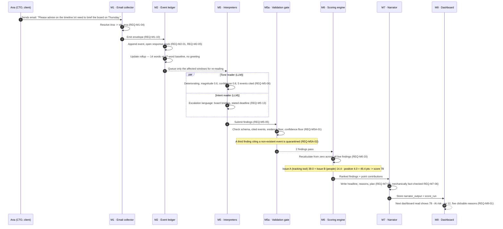

# 01 · Sequence — signal to score (the Sense loop)

Spec §10, end-to-end walkthrough: one email, from arrival to screen. Traces `REQ-M1-*` → `REQ-M2-*` → `REQ-M5-*` → `REQ-M5A-*` → `REQ-M6-*` → `REQ-M7-*` → `REQ-M8-*`.

## Diagram

## Timing budget (spec §10, §8.9)

| Step | Elapsed | NFR reference |
|---|---|---|
| Email arrives → envelope emitted | ~1s | — |
| Envelope → ledger append | ~1s | — |
| Ledger → readers dispatch | ~1s | Only affected windows queued |
| Readers → findings ready | ~34s | Two LLM calls (Tone, Intent) in parallel |
| Validation gate | < 1s | Deterministic checks |
| Scoring engine | < 1s | Deterministic arithmetic |
| Narrator | ~1s | Structured generation + fact-check |
| **Total** | **~38s** | Within REQ-NFR-02 (< 60s target ~40s) |
