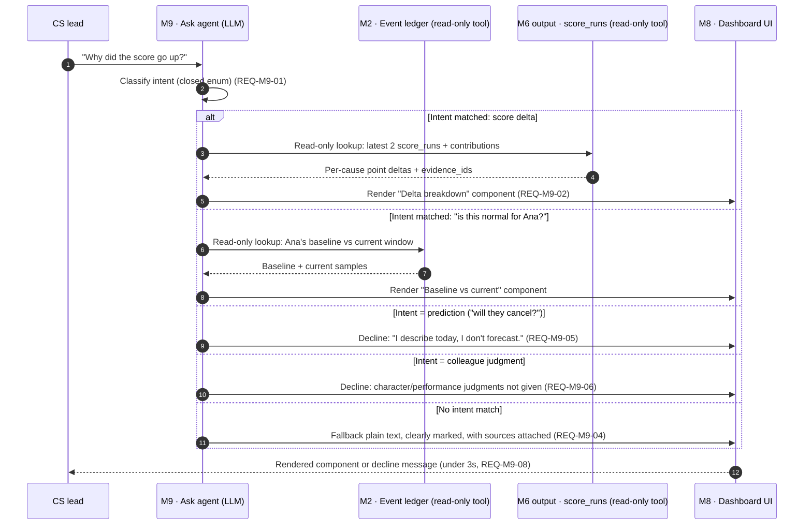

# 02 · Sequence — Ask agent (the Ask loop)

Spec §9.3, §12.2. Traces `REQ-M9-*`. Never recomputes the score — explains the one that already exists.

## Diagram

## Key invariant

At no point in this flow does the Ask agent call the Scoring engine (M6) to produce a new number — every branch either reads already-persisted `score_runs`/`findings`/`events` or declines. This is enforced by granting the Ask agent's LLM tool-use **only read-only lookup tools** (see `architecture/04-ai-safety-and-model-usage.md`).
