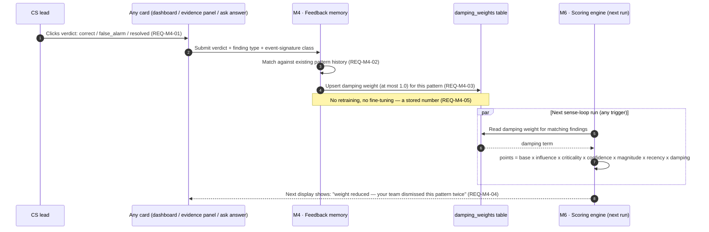

# 03 · Sequence — Feedback loop (the Learning loop)

Spec §9.3, M4. Traces `REQ-M4-*`. Human-driven; changes future weight, never past scores.

## Diagram

## Key invariant

Feedback never edits a past `score_run` (spec §8.7: the previous score is never an input to the calculation). It only changes the `damping` term used by **future** scoring runs — so history remains an honest record of what was believed at the time.
