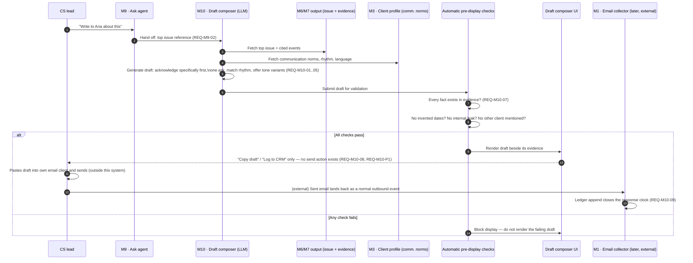

# 04 · Sequence — Draft composer

Spec §12.3, M10. Traces `REQ-M10-*`. Ends with **no send** — the human takes the drafted text into their own tool.

## Diagram

## Key invariant

There is no arrow in this diagram from the Draft composer UI to any client-facing transport (SMTP, chat API). The human-send step happens **outside the system boundary**, and only re-enters as a normal collected event once the human has already sent it through their own tool — matching product principle P4 exactly.
