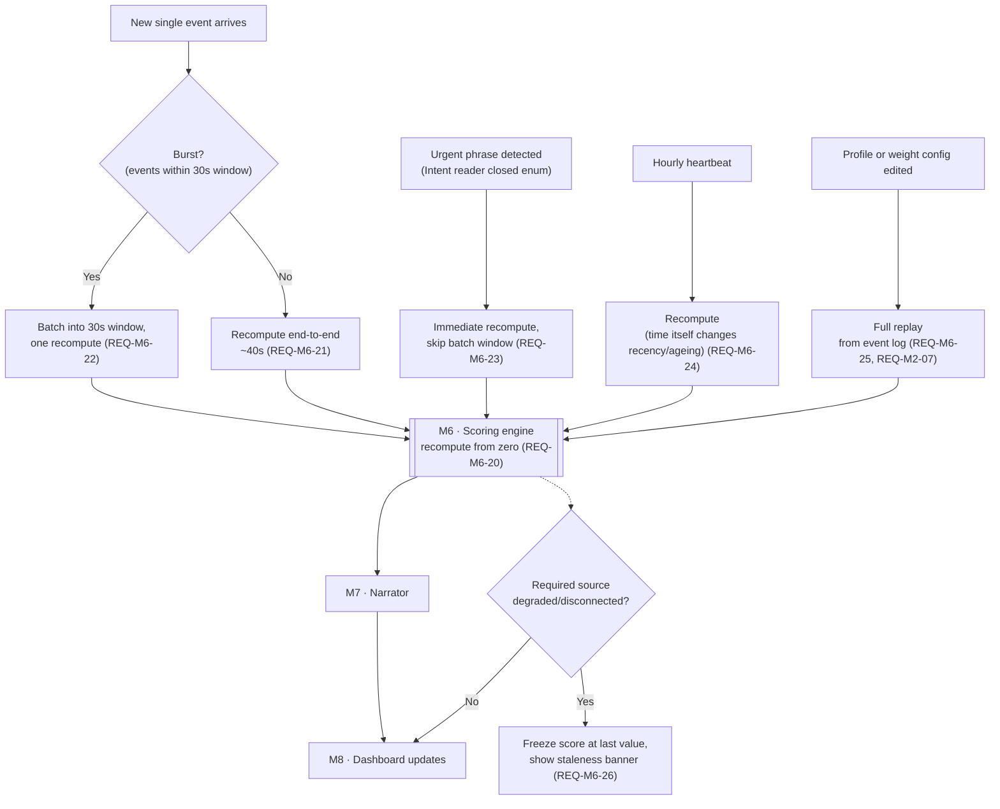

# 05 · Flow — recompute triggers

Spec §8.9. Traces `REQ-M6-20 … REQ-M6-26`. Five distinct triggers, one shared recompute path, plus the four quiet-period behaviors that fall out of the same rules.

## Trigger flow

## Quiet-period behavior matrix (spec §8.9)

| Situation | Score behaviour | Driven by |
|---|---|---|
| Quiet, nothing pending | Drifts slowly down as fixed issues fade | REQ-M6-09 (resolved-state half-life) |
| Quiet, we owe a reply | Climbs daily — the promise ages | REQ-M6-11 (open-and-overdue ageing multiplier) |
| Quiet, client has gone silent | Jumps when the absence threshold is crossed | REQ-M1-06 (absence collector) → REQ-M5-10 (Absence reader) |
| Quiet because a source is broken | Frozen, with a visible warning banner | REQ-M6-26, REQ-NFR-07 |
