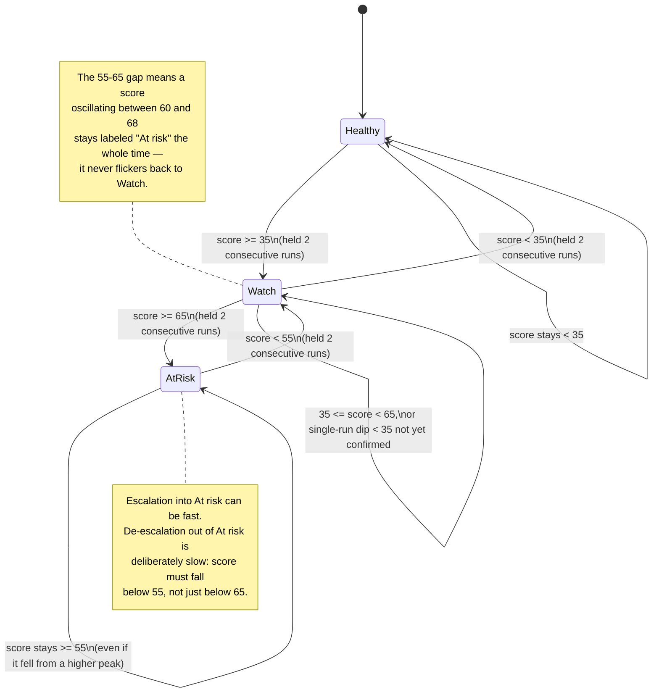

# 06 · State diagram — band hysteresis

Spec §8.6. Traces `REQ-M6-17 … REQ-M6-19`. The gap between the 65-enter and 55-exit thresholds is deliberate hysteresis so the label doesn't flip when the score wobbles; a band change also requires the score to hold across two consecutive runs.

## Diagram

## Worked example (spec §10)

| Run | Score | Raw threshold check | Displayed band |
|---|---|---|---|
| Week 0 | 78 | ≥ 65 | At risk (entered) |
| Week 1 | 61 | ≥ 55, so stays (< 65 alone would not exit) | **At risk** (unchanged — 61 > 55 exit floor) |

The score fell by 17 points, but the band correctly stays "At risk" because 61 is still above the 55 exit threshold — preventing a premature "everything's fine" signal while Diego (unresolved, unfaded) remains the top concern.
