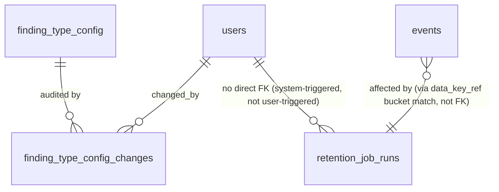

# Phase 1 Data Model: Production Hardening

Three new tables, one changed column semantics, zero changes to any existing table's shape.
Every new "who did this" column is a real `users.id` foreign key, per the constitution's
Ownership columns rule — no free-text attribution introduced anywhere in this feature.

## New: `retention_job_runs` (User Story 1, FR-002)

One row per scheduled retention job execution — durable, queryable independent of application
logs, per FR-002.

| Field | Type | Description |
|---|---|---|
| `id` | UUID PK | |
| `started_at` | TIMESTAMPTZ NOT NULL | |
| `completed_at` | TIMESTAMPTZ NULL | NULL while the run is still in progress or if it crashed before completing |
| `buckets_evaluated` | INTEGER NOT NULL DEFAULT 0 | Number of daily key-rotation buckets checked against the retention window (Decision 1) |
| `buckets_shredded` | INTEGER NOT NULL DEFAULT 0 | Number whose key was destroyed this run — nulls every matching `events.body_encrypted` row too; `raw_envelopes.payload_encrypted` is never touched (correction found during implementation: it's `NOT NULL` and the DDL's own design already makes key destruction alone sufficient there, see `research.md` Decision 1) |
| `status` | ENUM(`succeeded`,`failed`) NOT NULL | |
| `error_detail` | TEXT NULL | Populated only when `status = failed` (FR-004a) |

**Validation rules:** `completed_at >= started_at` when both are set. `buckets_shredded <=
buckets_evaluated`. Insert-only — a run's outcome is never edited after the fact, matching
every other audit-shaped table in this schema (`replay_runs`, `collector_runs`).

**Relationships:** No FK to `events`/`raw_envelopes` — a run's effect on those tables is
observable via their own `data_key_ref`/`body_encrypted` state, not a join table, keeping the
append-only tables themselves untouched in shape.

## Not a database entity: the shredded-body read sentinel (User Story 1, FR-004)

`GetEvidenceTraceUseCase` never sees `EncryptionKeyError` (defined in
`app.ingestion.adapters.encryption`, an adapter-layer exception) — the evidence-read
repository implementation catches it internally and returns a plain `body_available: bool`
field alongside its existing return shape. The use case, and `evidence_router.py` after it,
branch only on that field. This keeps `EncryptionKeyError` out of the application layer
entirely (`/speckit-analyze` finding C1 — the same layer-boundary discipline feature 008 had
to retrofit once, in `narration_v1.py`, applied here from the start).

## Changed: `data_key_ref` semantics (User Story 1, Decision 1)

No column type change on `events.data_key_ref` / `raw_envelopes.data_key_ref` (both remain
`TEXT NOT NULL`, exactly as `data-base/10-ddl-appendix.md` already defines). What changes is
what the application writes into it: previously the single constant
`settings.encryption_key_id` (`"local-v1"`), now the UTC calendar date (`YYYY-MM-DD`) of the
row's `occurred_at`, one value per daily key-rotation bucket (Decision 1). Existing rows
written under the old scheme keep their literal `"local-v1"` value forever (insert-only,
`data_key_ref` is permanent) — the retention job simply never matches `"local-v1"` against a
date-keyed bucket window, so pre-migration rows age out under a documented one-time manual
exception (`quickstart.md` covers this explicitly), not a silent gap.

## New: `finding_type_config_changes` (User Story 4, FR-014)

One row per base-weight edit — who changed it, when, previous and new value.

| Field | Type | Description |
|---|---|---|
| `id` | UUID PK | |
| `finding_type` | TEXT NOT NULL, FK → `finding_type_config.finding_type` | |
| `previous_base_points` | NUMERIC(6,2) NOT NULL | |
| `new_base_points` | NUMERIC(6,2) NOT NULL | |
| `changed_by_user_id` | UUID NOT NULL, FK → `users.id` | Ownership column, per constitution |
| `changed_at` | TIMESTAMPTZ NOT NULL DEFAULT now() | |
| `config_version_after` | TEXT NOT NULL | The `finding_type_config.version` value this change produced — lets a reviewer correlate a `score_runs.finding_type_config_version` back to the exact change that created it |

**Validation rules:** `new_base_points >= 0` (mirrors `finding_type_config.base_points`'s own
implicit non-negativity — a negative base weight has no defined meaning anywhere in the scoring
model). Insert-only, same audit-table shape as `retention_job_runs`.

**Relationships:** `finding_type` FK ties every change to a real, existing config row — a
weight change for a finding type that doesn't exist in `finding_type_config` is rejected at
the same boundary FR-016 already rejects an unauthorized user, not silently inserted.

## Changed: `TokenRecord` / `CurrentUser` gain `role` (User Story 2, Decision 2)

Not a schema change — `users.role` already exists (`data-base/12-users-and-auth.md`). The
change is in the application-layer shape returned by the existing auth query:

- `TokenRecord` (`app.auth.application.ports`): adds `role: str | None`, sourced from a `JOIN
  users ON users.id = auth_tokens.user_id` the `get_by_hash` query gains.
- `CurrentUser` (`app.auth.application.dependencies`): adds `role: str | None`, threaded
  straight through from `TokenRecord`.

No new entity — this is the first real consumer of a column that already exists.

## Not a database entity: the `access_decision` structured log line (User Stories 2 & 4, FR-008)

FR-008 ("record which role a request was authorized under") is satisfied by a structured log
line, not a new table or column — `users.role` is mutable, so the record needs the role **as
it was at the moment of the decision**, which a later join to `users.role` cannot reconstruct.
`require_full_access` (US2) and `require_admin` (US4) each emit one `access_decision` log line
per call — `{"event": "access_decision", "user_id": ..., "role": ..., "outcome": "allowed" |
"denied"}` — via the standard `logging` module, matching this codebase's already-adopted
Phase 1 structured-logging default (`architecture/03-technology-stack.md`). No schema change,
no new "who did this" foreign key (`/speckit-analyze` finding G1).

## Fixture data additions (User Story 6, Decision 5)

Not a database entity — `demo/fixtures/meridian-week.json` gains three new top-level arrays
(`slack`, `csat`, `calendar`), each shaped like the existing `gmail`/`zendesk`/`warehouse`
arrays `_normalize_*` functions already consume. `calendar` entries additionally carry a
`consent_documented: bool` field per meeting series, read by the new `MeetingReader` to enforce
FR-023 — the one new field this feature adds to the fixture format, everything else reuses the
existing envelope shape unchanged.

## Entity relationship summary

`retention_job_runs` deliberately has no FK to `users` — FR-001's job is scheduled, not
user-triggered, matching `collector_runs`' own existing precedent of having no
`triggered_by_user_id` either.
